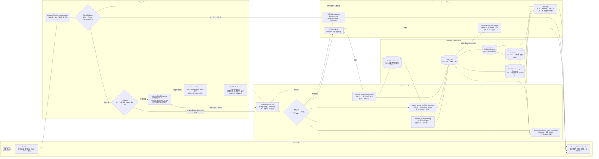

# 存续期业务数据探针智能体

面向银行贷后管理、后续尽职调查和存续期风险监测的本地优先智能分析工作台。

## 快速开始

```bash
pnpm install
pnpm dev
pnpm desktop:typecheck
pnpm desktop:build
```

## 当前工程结构

- `apps/desktop`: Electron + React + Vite 桌面客户端。
- `docs`: MVP、BRD、PRD 等业务确认文档。
- `plan`: 系统分析和方案设计输入。
- `reference`: 存续期业务背景资料。

## Agent 工作流流程示意图

当前版本的 Agent 工作流以 `AssistantRuntime.sendMessage` 为入口，围绕“会话上下文准备、缺参与断点恢复、大模型推理、受控工具调用、Artifact/报告产出、异常恢复”推进。下图参照 `beautiful-mermaid` 的 **System Architecture** 分层图样式组织，将流程拆为 Client、Runtime、Tool、Data 和 Recovery 五层；渲染时使用 `THEMES['dracula']` 主题，保持与示例站点 Dracula 主题图表风格一致。


