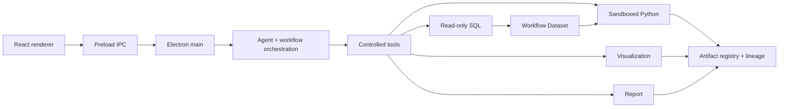

# Architecture Overview

## Runtime Boundaries

Lifecycle X has two pnpm workspace applications:

- `apps/desktop`: Electron main and preload processes plus the React renderer.
- `apps/server`: HTTP-facing authentication and data capabilities, including
  persistent data sources, SQL execution, Python execution, schema context, and
  local memory.

The renderer presents state and requests capabilities through preload IPC. The
Electron main process owns local SQLite state, model calls, Agent runs,
workflows, tool approvals, and Artifact coordination.

## Agent and Tool Relationship

The Agent identifies intent and creates an ordered plan. Execution models
produce parameters for one planned tool at a time. Local code validates
schemas, permissions, and safety rules before actual execution. Models do not
execute SQL or Python and do not create authoritative tool results.

Tool state, approval, result versions, and Artifact lineage are persisted in
the desktop runtime. User-visible progress is derived from persisted Agent runs
and events rather than raw provider reasoning.

## Data Flow

1. A user message and selected context enter `AssistantRuntime`.
2. Agent orchestration resolves intent, prior Artifacts, and required tools.
3. SQL reads an authorized source and materializes a controlled Workflow Dataset.
4. Python consumes that dataset when analysis or derived metrics are required.
5. Chart generation consumes a SQL/Python Artifact and creates a visualization Artifact.
6. Report generation consumes existing analysis and chart Artifacts and creates Markdown.
7. The renderer reads messages, `tool_calls`, and Artifact content through IPC.

Full source datasets are not placed in model context. Models receive required
schemas, selected fields, compact summaries, and Artifact references.

## Artifact Lineage

`conversationId`, message, Agent run, tool call, Workflow Dataset, and Artifact
identifiers preserve the origin and dependency chain of results. Downstream
tools refer to registered upstream results; a report or chart is not an
independent source of truth.

## CSV Modes

- Persistent CSV: imported through data management, validated with its table
  dictionary, and registered as a reusable data source by the server.
- Conversation CSV: imported from ChatComposer, stored in the desktop local
  SQLite runtime, scoped to the conversation, and exposed as temporary schema
  and Workflow Dataset context.

Neither mode permits silently substituting an unrelated source when execution
fails.

## Detailed Topics

- [Architecture boundaries](boundaries.md)
- [Dual-model Thinking architecture](thinking-optimization.md)
- [Repository map](../repo-map.md)
