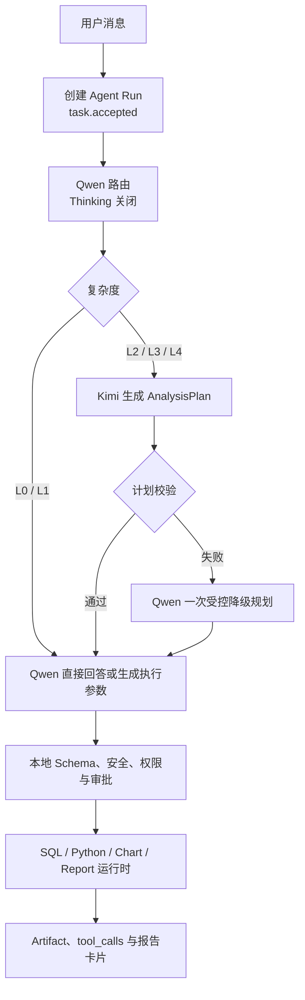
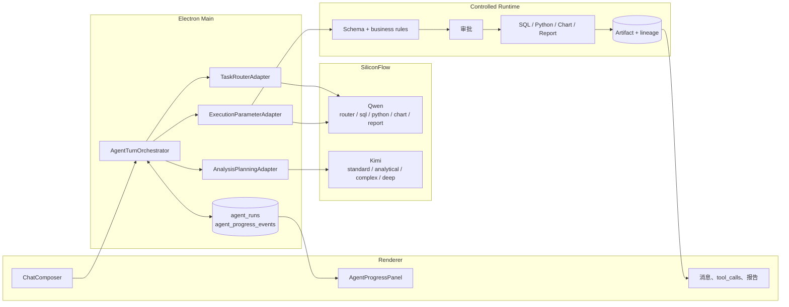

# 双模型 Thinking 配置与流式架构

## 1. 改造背景

桌面端此前由单一模型同时承担意图判断、工具编排和参数生成。开启 Kimi Thinking 后，`reasoning_content` 会先于最终正文到达，用户可能长时间看不到业务状态；SQL、Python、图表和报告阶段也可能重复消耗高配推理模型。

本次改造保持 Electron、SQLite、现有工具审批和 Artifact 机制不变，将职责固定为：

- Kimi：复杂业务决策、结构化规划、异常归因和必要复核。
- Qwen：快速路由、单工具参数生成、确定性回答和 Markdown 报告。
- 本地工具层：安全校验、审批、SQL/Python 执行、图表和报告 Artifact 登记。
- 前端：只展示 Agent 业务状态、工具结果和成果，不展示原始思维链。

## 2. 当前调用链

入口为 `AssistantRuntime.sendMessage`。启用双模型与动态 Thinking 后，单轮请求按以下路径执行：



模型原始流由 `OpenAICompatibleProvider` 解析为 Provider 事件，再由 `StreamingModelAdapter` 和 `AgentTurnOrchestrator` 转换为业务事件。React 页面不解析 SiliconFlow SSE。

## 3. 目标架构



## 4. 双模型职责

| 组件 | 负责 | 不负责 |
| --- | --- | --- |
| Qwen Router | 任务类型、L0-L4、工具能力、歧义和摘要 | SQL、Python、报告正文 |
| Kimi Planner | `AnalysisPlan`、依赖、业务定义、验证规则 | 工具参数、脚本、最终报告 |
| Qwen Executor | 当前一个步骤的紧凑参数 | 修改计划、增加指标 |
| 本地运行时 | 参数校验、审批、执行、Artifact 血缘 | 猜测业务口径 |
| Renderer | 业务进度和成果 | Provider SSE、原始 reasoning |

Kimi 规划输出必须解析为 `AnalysisPlan`。`reasoning_content` 仅更新通用规划状态，不进入计划、消息正文、报告或普通日志。

## 5. L0-L4 路由规则

| 等级 | 典型任务 | Kimi | 默认 Budget |
| --- | --- | --- | --- |
| L0 | 元数据、预览、已有结果格式调整 | 跳过 | 0 |
| L1 | 单表筛选、聚合、排序、Top N | 跳过 | 0 |
| L2 | 查询后分析、图表或报告 | 使用 | 512 |
| L3 | 业务歧义、异常归因、多轮验证 | 使用 | 1024，最多自动升至 2048 |
| L4 | 用户明确要求深度分析或高风险专题 | 使用 | 4096 |

路由结果经过运行时校验。路由结构失败最多修复一次，不因失败直接启用高预算。简单任务直接使用 Qwen，不经过 Kimi。

## 6. Thinking Budget 策略

Kimi Profile 集中定义于 `modelRuntimeConfig.ts`：

- `fast`: Thinking 关闭，`maxTokens=2048`
- `standard`: Budget 512，`maxTokens=4096`
- `analytical`: Budget 1024，`maxTokens=8192`
- `complex`: Budget 2048，`maxTokens=12000`
- `deep`: Budget 4096，`maxTokens=16000`

自动升级只接受结构化信号，例如三个以上数据表、多个非阻塞歧义、方法选择、结果冲突、三轮以上工具调用或数据质量警告。解析失败不触发升级。每轮同时受单次 Budget、累计 Budget 和 Kimi 调用次数硬上限约束。

Qwen 的 `router/sql/python/chart/report` Profile 均强制 `enableThinking=false`。关闭 Thinking 时不会发送 `thinking_budget`。

## 7. Agent 流式事件协议

`AgentBusinessEvent` 是 Provider 无关协议，包含 `taskId`、`conversationId`、`messageId`、时间戳及可选 `stepId/toolCallId`。主要类型：

```text
task.accepted
task.summary.delta
routing.completed
planning.started
planning.progress
plan.completed
tool.started
tool.progress
tool.completed
validation.completed
report.delta
completed
failed
cancelled
```

事件在写入 SQLite 前进行运行时校验。Run 与进度可通过只读 IPC 重新加载，因此 Renderer 重连后不依赖 Provider 连接恢复展示。Markdown 正文使用现有有序 `stream-content` 协议，按 `messageId + segmentId + sequence` 去重。

## 8. Reasoning Content 处理

默认且不可由普通 UI 开启：

```yaml
raw_reasoning_visible: false
raw_reasoning_persisted: false
```

Provider 解析 `reasoning_content` 后只产生脱敏的 `reasoning-progress` 观测事件，并记录首事件时间和字符计数。原始文本不写入消息、计划、SQLite 审计或 JSONL 日志。实际 reasoning token 仅在 Provider 返回 usage 时记录，否则保持未知。

## 9. 超时与降级

- Provider 网络错误和 429/5xx：最多自动重试一次，带指数退避和抖动。
- Kimi 首事件超时：中止该请求并记录 `PROVIDER_FIRST_EVENT_TIMEOUT`。
- Kimi 规划超时或非法结构：同 Budget 修复一次；仍失败时由 Qwen 发起一次真实的结构化降级规划。
- Qwen 降级计划仍非法：停止自动执行，展示模型可见响应或具体补充建议；不创建本地预制执行计划。
- SQL 数据库执行失败：Qwen 修复一次；第二次失败后在调用次数和累计 Budget 范围内调用 Kimi 诊断。
- 用户取消：同一个 `AbortSignal` 贯穿路由、规划、参数生成和工具进程；Run 持久化为 `cancelled`，重启不恢复执行。

## 10. 配置项

| 环境变量 | 默认值 | 说明 |
| --- | ---: | --- |
| `CYCLE_PROBE_THINKING_OPTIMIZATION_ENABLED` | `true` | 总开关 |
| `CYCLE_PROBE_DYNAMIC_ROUTING_ENABLED` | `true` | L0-L4 动态路由 |
| `CYCLE_PROBE_REASONER_MODEL` | `Pro/moonshotai/Kimi-K2.6` | 推理模型 |
| `CYCLE_PROBE_EXECUTOR_MODEL` | `Qwen/Qwen3-32B` | 执行模型 |
| `CYCLE_PROBE_DEFAULT_KIMI_PROFILE` | `standard` | 默认 Profile |
| `CYCLE_PROBE_MAX_THINKING_BUDGET` | `4096` | 单次硬上限 |
| `CYCLE_PROBE_MAX_KIMI_CALLS_PER_TASK` | `2` | 单任务调用上限 |
| `CYCLE_PROBE_MAX_CUMULATIVE_THINKING_BUDGET` | `6144` | 单任务累计上限 |
| `CYCLE_PROBE_THINKING_AUTO_UPGRADE_ENABLED` | `true` | 受控自动升级 |
| `CYCLE_PROBE_QWEN_FALLBACK_ENABLED` | `true` | Qwen 降级规划 |
| `CYCLE_PROBE_DEEP_THINKING_ENABLED` | `true` | 是否允许 4096 |
| `CYCLE_PROBE_REASONER_FIRST_EVENT_TIMEOUT_MS` | `20000` | 首事件超时 |
| `CYCLE_PROBE_PLANNING_TIMEOUT_MS` | `90000` | 总规划预算 |
| `CYCLE_PROBE_REASONING_CONTEXT_TOKEN_BUDGET` | `8000` | 推理上下文预算 |
| `CYCLE_PROBE_THINKING_ROLLOUT_PERCENTAGE` | `100` | 稳定哈希灰度比例 |

各 Kimi Profile 可通过 `CYCLE_PROBE_KIMI_<PROFILE>_THINKING_BUDGET/MAX_TOKENS` 覆盖；各 Qwen Profile 可通过 `CYCLE_PROBE_QWEN_<ROLE>_MAX_TOKENS` 覆盖。非法值回退到安全默认值。API Key 继续使用现有本地加密存储。

## 11. 监控指标

模型观测日志记录角色、阶段、模型、Profile、上下文字符/token 估算、TTFT、finish reason、usage、是否返回 tool calls 和参数形状。关键字段包括：

- 延迟：`taskAckLatencyMs`、`routerLatencyMs`、`kimiFirstEventLatencyMs`、`kimiReasoningDurationMs`、`planLatencyMs`、`firstToolStartLatencyMs`、`firstResultPreviewLatencyMs`、`reportTtftMs`、`totalTaskLatencyMs`
- Token：`kimiPromptTokens`、`kimiReasoningTokens`、`kimiOutputTokens`、`qwenPromptTokens`、`qwenOutputTokens`
- 成本与预算：`thinkingBudgetRequested`、`thinkingBudgetActual`、`estimatedCost`
- 质量：计划完成比例、fallback 次数、参数校验层、SQL 重试、取消和工具失败状态

日志不记录 API Key、数据库密码、完整数据、SQL/Python 正文、客户敏感信息或原始思维链。

## 12. 测试方法

```bash
pnpm desktop:typecheck
pnpm lint
pnpm --dir apps/desktop test
pnpm desktop:build
git diff --check
```

测试覆盖配置范围、L0-L4、Budget 升级、AnalysisPlan、事件协议、上下文裁剪、SiliconFlow 参数映射、reasoning 隔离、Provider 重试/超时/取消、L1 跳过 Kimi、L2 使用 512，以及 SQL/Python/Chart 的紧凑参数和客户端上下文注入。

本次实施的实际命令、结果和验收矩阵见
[Thinking 优化验证记录](../verification/thinking-optimization-validation.md)。

## 13. 灰度发布

1. 开发环境先保持 `CYCLE_PROBE_THINKING_ROLLOUT_PERCENTAGE=100` 完成功能回归。
2. 生产环境从 5% 开始，按 `userId + conversationId + taskId` 稳定分桶。
3. 对比 Kimi 调用率、简单任务误调用率、首工具延迟、fallback 率和任务完成率。
4. 分阶段提高到 25%、50%、100%；出现成本或质量回退时先降低比例，不切换未经评测的模型。

## 14. 回滚方案

- 快速关闭动态 Thinking：设置 `CYCLE_PROBE_THINKING_OPTIMIZATION_ENABLED=false`，或在客户端模型配置关闭“启用动态 Thinking”。
- 仅关闭动态路由：设置 `CYCLE_PROBE_DYNAMIC_ROUTING_ENABLED=false`，保留旧双模型流程。
- 禁止自动升级：设置 `CYCLE_PROBE_THINKING_AUTO_UPGRADE_ENABLED=false`。
- 禁止 Kimi 不可用时继续规划：设置 `CYCLE_PROBE_QWEN_FALLBACK_ENABLED=false`。
- 灰度归零：设置 `CYCLE_PROBE_THINKING_ROLLOUT_PERCENTAGE=0`。

新增 SQLite 表和列均为向后兼容的审计数据；旧消息、`tool_calls`、Artifact 和报告协议未改变。回滚代码时可保留这些表，不需要删除或迁移业务数据。
