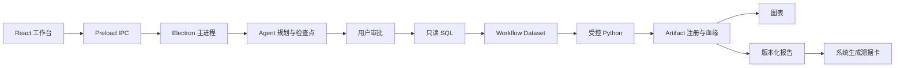

# 智能体技术架构与安全边界

## 架构闭环

模型负责意图识别、规划和单步工具参数生成；本地代码负责权限、Schema、安全校验、审批、真实执行和持久化。模型输出不是权威工具结果。

## 关键控制

- Renderer 通过 preload IPC 请求能力，不直接访问 Node、SQLite 或业务数据库。
- SQL 只允许授权范围内的只读查询，并保留审批、风险判断和审计记录。
- Python 只消费受控 Workflow Dataset/Artifact，不直接连接业务数据库；执行受脚本规则、超时、目录和输出约束控制。
- 图表与报告消费已注册 Artifact，不在上游失败时静默替换数据或编造指标。
- 报告溯据卡由系统根据持久化工具调用和血缘生成，并绑定具体报告版本，不由模型自由撰写。
- 模型上下文包含 Schema、字段映射、摘要和必要 Artifact 引用，不包含完整源数据或凭据。

## 数据和密钥

- 演示数据为固定脱敏 CSV，本地处理。
- 模型 API Key 由评委自行提供，经 Electron `safeStorage` 使用操作系统能力加密保存。
- 发布脚本排除 `.env`、用户数据库、日志、缓存和本地 Electron 文件，并扫描私钥、Token、带凭据连接串和个人绝对路径。
- 工具及报告保留来源、会话、版本和父 Artifact 标识，失败不会切换到模拟结果。

## 当前原型限制

- 这是黑客松源码评审版本，不是生产银行系统；通用演示账号和本地认证服务不得用于生产。
- Electron 使用 `contextIsolation` 且关闭 renderer 的 Node 集成，但当前 `sandbox` 未开启。
- Python 控制是应用级规则、目录和进程约束，不等同于容器或操作系统级强隔离。
- 本轮 Golden Path 使用本地脱敏 CSV；数据库连接管理和连接测试界面不构成生产数据库接入承诺。
- 系统生成分析材料供业务人员复核，不自动替代风险认定、授信决策或合规审批。
