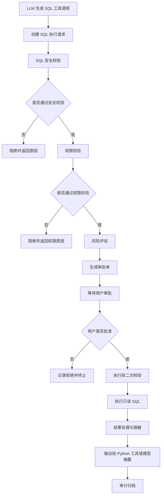

# 存续期数据探针智能体｜SQL 工具调用与审批流程模块开发

你现在是一个资深 TypeScript / Node.js / Electron / AI Agent / 数据安全 / 数据库工程师。围绕项目 **“存续期数据探针智能体 / Cycle Data Intelligence Agent”** 开发一个可落地、可测试、可扩展的 **“SQL 工具调用与审批流程”** 模块。

本模块用于为智能体提供安全可控的 SQL 查询能力：大模型根据用户需求和 Schema Context 推理生成 SQL 查询脚本，但 SQL 不允许直接执行，必须先经过 SQL 安全校验、权限校验、风险评估和用户审批。审批通过后，系统调用 SQL 查询工具执行查询，并将结果以受控方式返回给后续 Python 分析工具或大模型聚合总结。

---

## 1. 项目背景

项目名称：**存续期数据探针智能体 / Cycle Data Intelligence Agent**

项目面向银行贷款后续尽职调查、贷后管理、存续期风险监测、数据源探索、数据库 Compass、Schema Context 注入、SQL 查询、Python 分析、图表生成、风险报告生成等场景。

当前模块为：

> **SQL 工具调用与审批流程模块 / SQL Tool Invocation & Approval Workflow**

模块核心目标：

1. 为大模型提供语义明确、参数清晰、schema 严格的 SQL 查询工具；
2. 只允许执行查询类 SQL；
3. 禁止执行新增、修改、删除、DDL、权限变更、锁表、导出文件、调用存储过程等高风险 SQL；
4. 大模型只负责根据用户需求生成候选 SQL；
5. SQL 执行前必须经过权限校验、安全校验、风险评估和用户审批；
6. SQL 查询结果不能直接将源表全量数据输入给大模型；
7. SQL 查询结果可作为 Python 分析工具的输入；
8. SQL 查询结果可经过摘要、聚合、脱敏、裁剪后再返回给大模型；
9. 所有 SQL 生成、审批、执行、失败、拦截、结果输出都需要可审计。

---

## 2. 模块职责边界

本模块负责：

* SQL 工具定义；
* SQL 工具描述提示词；
* SQL 工具参数 schema；
* SQL 工具调用解析；
* SQL 查询计划创建；
* SQL 安全校验；
* SQL 权限校验；
* SQL 风险评估；
* SQL 用户审批流程；
* SQL 执行；
* 查询结果裁剪与脱敏；
* 查询结果摘要；
* 查询结果向 Python 分析工具传递；
* 查询结果向大模型安全回传；
* 审计日志；
* 错误处理。

本模块不负责：

* 大模型底层流式调用；
* Markdown 渲染；
* Python 分析工具具体执行逻辑；
* 图表生成具体渲染逻辑；
* 数据源连接配置 UI；
* 数据源 Schema Context 构建；
* 大模型最终自然语言报告生成。

但本模块应预留接口，方便与以下模块集成：

* Streaming Model Adapter；
* Schema Context Injection；
* Tool Registry；
* Python Analysis Tool；
* Chart Generation Tool；
* Agent Runtime；
* Electron IPC；
* Audit Log Service；
* Data Source Permission Service。

---

## 3. 推荐目录结构

请优先复用现有结构，不要重构无关模块。

---

## 4. 核心原则

请在实现中严格遵守以下原则：

1. **只读 SQL**

   * 仅允许 `SELECT` / `WITH ... SELECT` 查询类 SQL；
   * 禁止任何 DML / DDL / DCL / TCL / 系统命令 / 文件导出 / 锁表 / 存储过程调用。

2. **模型不能直接执行 SQL**

   * 大模型只能生成候选 SQL；
   * SQL 必须经过系统校验和用户审批后才能执行。

3. **执行前必须审批**

   * 即使 SQL 被判断为低风险，也必须进入审批流程；
   * 可根据用户权限和策略决定是否自动审批，但默认需要用户确认。

4. **权限优先于 SQL 安全**

   * 用户没有数据源、表、字段权限时，即使 SQL 语法安全，也不能执行。

5. **结果不直接裸传给大模型**

   * 查询到的源表数据不能无裁剪、无脱敏、无摘要地直接输入给大模型；
   * 返回给大模型的是结构化摘要、聚合结果、字段说明、有限样例或已脱敏结果。

6. **可供 Python 分析工具使用**

   * 对于相关性分析、趋势分析、异常检测、分组统计等任务，SQL 查询结果可作为 Python 分析工具输入；
   * 传递给 Python 工具也应遵循权限、行数、字段、安全策略。

7. **可审计**

   * SQL 生成、审批、执行、失败、拒绝、拦截、结果处理都必须记录审计事件。

---

## 5. SQL 工具设计

请设计并实现一个语义明确的工具。

### 5.1 工具名

推荐工具名：

```text
request_sql_query_execution
```

不要使用过于宽泛的名称，例如：

* `run_sql`
* `execute`
* `query`
* `db_tool`

工具名应明确表达：这是一个需要审批的 SQL 查询执行请求。

### 5.2 工具用途描述

请在 `sql-tool-prompt.ts` 中提供工具描述提示词，供 Tool Registry 或模型工具注入使用。

工具描述建议：

```text
request_sql_query_execution is a controlled read-only SQL query execution request tool.

Use this tool only when the user asks for data retrieval, filtering, aggregation, sorting, joining, statistical preparation, report data extraction, or data exploration that requires querying configured data sources.

The model must provide a read-only SQL statement and explain the purpose of the query. The SQL will not be executed immediately. It will first be validated, checked against user permissions, assessed for risk, and submitted for user approval. Only approved queries can be executed.

Never use this tool for INSERT, UPDATE, DELETE, DROP, ALTER, TRUNCATE, CREATE, GRANT, REVOKE, CALL, EXEC, LOCK, file export, database mutation, permission changes, or any high-risk operation.
```

同时提供中文描述：

```text
request_sql_query_execution 是一个受控的只读 SQL 查询执行请求工具。

仅当用户需求需要从已配置数据源中检索、筛选、聚合、排序、关联、统计准备、报告取数或数据探索时，才使用该工具。

模型需要提供只读 SQL 语句，并说明查询目的。SQL 不会被立即执行，而是先经过安全校验、用户权限校验、风险评估和用户审批。只有审批通过的查询才能执行。

禁止使用该工具执行 INSERT、UPDATE、DELETE、DROP、ALTER、TRUNCATE、CREATE、GRANT、REVOKE、CALL、EXEC、LOCK、文件导出、数据库变更、权限变更或其他高风险操作。
```

---

## 6. 工具参数 Schema

请实现严格的工具参数类型和 JSON Schema。

### 6.1 TypeScript 类型

```ts
export type RequestSqlQueryExecutionInput = {
  dataSourceId: string;
  sql: string;
  purpose: string;
  expectedResultUse: SqlResultUse;
  resultConsumer?: SqlResultConsumer;
  referencedTables?: string[];
  referencedColumns?: string[];
  queryIntent?: SqlQueryIntent;
  maxRows?: number;
  timeoutMs?: number;
  requireApproval?: boolean;
  approvalReason?: string;
  metadata?: Record<string, unknown>;
};
```

### 6.2 枚举类型

```ts
export type SqlResultUse =
  | 'model_summary'
  | 'python_analysis'
  | 'chart_generation'
  | 'risk_report'
  | 'data_preview'
  | 'debug';

export type SqlResultConsumer =
  | 'llm'
  | 'python_tool'
  | 'chart_tool'
  | 'agent_runtime'
  | 'user_preview';

export type SqlQueryIntent =
  | 'filter'
  | 'aggregation'
  | 'group_by'
  | 'top_n'
  | 'join'
  | 'time_series'
  | 'risk_signal_extraction'
  | 'customer_profile'
  | 'loan_due_diligence'
  | 'data_quality_check'
  | 'general_query';
```

### 6.3 JSON Schema 要求

请实现工具输入 schema，至少包含：

* `dataSourceId`

  * required；
  * string；
  * 只能引用用户有权限的数据源。

* `sql`

  * required；
  * string；
  * 最小长度 1；
  * 最大长度可配置，例如 20000；
  * 禁止空 SQL；
  * 禁止多语句。

* `purpose`

  * required；
  * string；
  * 描述 SQL 查询目的；
  * 不能为空；
  * 用于审批展示和审计。

* `expectedResultUse`

  * required；
  * enum；
  * 表示查询结果用途。

* `resultConsumer`

  * optional；
  * enum；
  * 表示结果将交给谁使用。

* `referencedTables`

  * optional；
  * string[]；
  * 模型推断 SQL 涉及的表，系统会重新解析校验，不完全信任该字段。

* `referencedColumns`

  * optional；
  * string[]；
  * 模型推断 SQL 涉及的字段，系统会重新解析校验，不完全信任该字段。

* `maxRows`

  * optional；
  * number；
  * 默认值由系统策略决定；
  * 最大值不得超过系统配置。

* `timeoutMs`

  * optional；
  * number；
  * 不得超过系统配置。

* `requireApproval`

  * optional；
  * boolean；
  * 默认 true。

* `approvalReason`

  * optional；
  * string；
  * 用于说明为什么需要执行该 SQL。

---

## 7. 工具返回结果定义

请设计清晰的工具返回结果。

注意：工具调用后可能只是创建审批请求，并不一定立即执行 SQL。

### 7.1 工具返回类型

```ts
export type RequestSqlQueryExecutionOutput = {
  requestId: string;
  status: SqlExecutionRequestStatus;
  dataSourceId: string;
  normalizedSql: string;
  purpose: string;
  expectedResultUse: SqlResultUse;
  riskAssessment: SqlRiskAssessment;
  permissionCheck: SqlPermissionCheckResult;
  safetyCheck: SqlSafetyCheckResult;
  approval: SqlApprovalState;
  execution?: SqlExecutionResult;
  message: string;
  createdAt: string;
};
```

### 7.2 状态类型

```ts
export type SqlExecutionRequestStatus =
  | 'draft'
  | 'blocked'
  | 'pending_approval'
  | 'approved'
  | 'rejected'
  | 'executing'
  | 'completed'
  | 'failed'
  | 'cancelled'
  | 'expired';
```

### 7.3 执行结果类型

```ts
export type SqlExecutionResult = {
  executionId: string;
  requestId: string;
  status: 'success' | 'failed' | 'timeout' | 'cancelled';
  columns: SqlResultColumn[];
  rows?: Record<string, unknown>[];
  summary: SqlResultSummary;
  safeModelPayload?: SqlModelResultPayload;
  pythonAnalysisPayload?: SqlPythonAnalysisPayload;
  rowCount: number;
  truncated: boolean;
  masked: boolean;
  executionTimeMs: number;
  warnings: string[];
  createdAt: string;
};
```

---

## 8. SQL 安全校验

请实现 `SqlSafetyValidator`。

### 8.1 允许的 SQL

仅允许：

* `SELECT ...`
* `WITH ... SELECT ...`

### 8.2 禁止的 SQL

必须拦截以下 SQL 类型或关键词：

```text
INSERT
UPDATE
DELETE
MERGE
UPSERT
DROP
ALTER
TRUNCATE
CREATE
RENAME
REPLACE
GRANT
REVOKE
COMMIT
ROLLBACK
SAVEPOINT
LOCK
UNLOCK
CALL
EXEC
EXECUTE
LOAD DATA
COPY
INTO OUTFILE
INTO DUMPFILE
ATTACH
DETACH
PRAGMA
VACUUM
ANALYZE
EXPLAIN ANALYZE
SELECT ... FOR UPDATE
SELECT ... FOR SHARE
```

也要拦截：

* 多语句执行；
* SQL 注释绕过；
* 分号拼接；
* 危险函数；
* 访问系统表；
* 访问未授权 schema；
* 非白名单数据源；
* 无条件大表全表扫描，当前可用规则预留；
* 未指定 LIMIT 的高风险查询，当前可自动追加或要求审批；
* 查询结果可能超限的 SQL。

### 8.3 校验结果类型

```ts
export type SqlSafetyCheckResult = {
  passed: boolean;
  level: 'safe' | 'warning' | 'blocked';
  reasons: SqlSafetyIssue[];
  normalizedSql?: string;
  detectedStatementType?: string;
  detectedTables?: string[];
  detectedColumns?: string[];
  hasLimit?: boolean;
  hasJoin?: boolean;
  hasAggregation?: boolean;
  hasSubQuery?: boolean;
  hasPotentialFullScan?: boolean;
};
```

```ts
export type SqlSafetyIssue = {
  code: SqlSafetyIssueCode;
  severity: 'info' | 'warning' | 'error' | 'critical';
  message: string;
  location?: string;
};
```

### 8.4 Issue Code

```ts
export type SqlSafetyIssueCode =
  | 'NON_SELECT_STATEMENT'
  | 'MULTIPLE_STATEMENTS'
  | 'FORBIDDEN_KEYWORD'
  | 'DANGEROUS_FUNCTION'
  | 'SYSTEM_TABLE_ACCESS'
  | 'UNAUTHORIZED_SCHEMA'
  | 'MISSING_LIMIT'
  | 'POTENTIAL_FULL_SCAN'
  | 'LARGE_TABLE_QUERY'
  | 'UNSUPPORTED_SQL'
  | 'PARSE_FAILED';
```

建议使用 SQL parser 库进行解析。如果当前项目无法引入 parser，可先实现基础词法检测和正则检测，并在代码中预留 parser adapter。

---

## 9. 权限校验

请实现 `SqlPermissionValidator`。

权限校验必须发生在 SQL 执行前。

### 9.1 权限维度

至少支持：

* 用户是否可访问该数据源；
* 用户是否可访问 SQL 涉及表；
* 用户是否可访问 SQL 涉及字段；
* 用户是否可查看敏感字段；
* 用户是否可访问大表；
* 用户是否可执行 join；
* 用户是否可执行聚合；
* 用户是否可导出或传递结果给 Python 工具；
* 用户是否可发起高风险查询；
* 用户是否具备审批权限或自动审批权限。

### 9.2 权限上下文类型

```ts
export type SqlUserPermissionContext = {
  userId: string;
  roles: string[];
  dataSourcePermissions: DataSourcePermission[];
  tablePermissions?: TablePermission[];
  columnPermissions?: ColumnPermission[];
  allowSensitiveFields?: boolean;
  allowLargeTableQuery?: boolean;
  allowJoinQuery?: boolean;
  allowAggregationQuery?: boolean;
  allowPythonAnalysisPayload?: boolean;
  allowAutoApproval?: boolean;
  approvalPolicy?: SqlApprovalPolicy;
};
```

### 9.3 校验结果类型

```ts
export type SqlPermissionCheckResult = {
  passed: boolean;
  reasons: SqlPermissionIssue[];
  allowedDataSource: boolean;
  allowedTables: string[];
  deniedTables: string[];
  allowedColumns: string[];
  deniedColumns: string[];
  sensitiveColumns: string[];
  requiresMasking: boolean;
  requiresApproval: boolean;
};
```

---

## 10. 风险评估

请实现 `SqlRiskAssessor`。

风险评估用于审批展示和执行策略控制。

### 10.1 风险等级

```ts
export type SqlRiskLevel = 'low' | 'medium' | 'high' | 'blocked';
```

### 10.2 风险评估因素

至少考虑：

* 是否查询大表；
* 是否涉及敏感字段；
* 是否 join 多表；
* 是否聚合大范围数据；
* 是否缺少 LIMIT；
* 是否可能全表扫描；
* 是否结果用于 Python 分析；
* 是否结果用于图表生成；
* 是否查询字段过多；
* 是否查询行数过多；
* 是否查询耗时可能较长；
* 用户权限等级；
* 数据源保护等级。

### 10.3 风险结果类型

```ts
export type SqlRiskAssessment = {
  riskLevel: SqlRiskLevel;
  score: number;
  reasons: string[];
  requiresApproval: boolean;
  requiresHigherPrivilege?: boolean;
  recommendedMaxRows: number;
  recommendedTimeoutMs: number;
  recommendedResultMode: SqlResultMode;
};
```

```ts
export type SqlResultMode =
  | 'summary_only'
  | 'limited_rows'
  | 'aggregated_result'
  | 'python_payload'
  | 'blocked';
```

---

## 11. 审批流程

请实现 `SqlApprovalWorkflow`。

### 11.1 流程



### 11.2 审批状态

```ts
export type SqlApprovalState = {
  approvalId: string;
  status: 'not_required' | 'pending' | 'approved' | 'rejected' | 'expired';
  requestedBy: string;
  approvedBy?: string;
  rejectedBy?: string;
  reason?: string;
  riskLevel: SqlRiskLevel;
  createdAt: string;
  updatedAt?: string;
  expiresAt?: string;
};
```

### 11.3 审批动作

需要实现：

```ts
createSqlExecutionRequest(input)
getSqlExecutionRequest(requestId)
approveSqlExecutionRequest(requestId, userContext)
rejectSqlExecutionRequest(requestId, userContext, reason)
executeApprovedSqlRequest(requestId, userContext)
cancelSqlExecutionRequest(requestId, userContext)
```

### 11.4 审批展示信息

审批单应包含：

* 用户原始需求；
* SQL 查询目的；
* 数据源；
* 目标表；
* 目标字段；
* SQL 语句；
* 风险等级；
* 风险原因；
* 权限校验结果；
* 预计返回行数上限；
* 超时时间；
* 结果用途；
* 是否涉及敏感字段；
* 是否需要脱敏；
* 是否会传递给 Python 分析工具；
* 是否会返回给大模型；

---

## 12. SQL 执行器

请实现 `SqlExecutor`。

### 12.1 执行要求

执行 SQL 前必须再次校验：

* 请求状态必须为 `approved`；
* 审批未过期；
* 用户权限仍有效；
* SQL 安全校验仍通过；
* 数据源状态正常；
* 未触发熔断；
* 未超过并发和频率限制，当前可预留。

### 12.2 执行限制

必须支持：

* 只读执行；
* 参数化，当前模型生成 SQL 可以先做静态 SQL，预留参数化接口；
* 查询超时；
* 最大返回行数；
* 最大返回字节数；
* 字段脱敏；
* 敏感字段屏蔽；
* 查询取消，当前可预留；
* 执行审计；
* 错误捕获。

### 12.3 执行结果不得直接裸传给大模型

原始 `rows` 可以保存在执行结果中，供用户预览或 Python 分析工具使用，但传给大模型的 `safeModelPayload` 必须经过以下处理：

* 限制行数；
* 限制字段；
* 敏感字段脱敏；
* 大字段截断；
* 统计摘要化；
* 不传全量源表数据；
* 标明结果是否被截断；
* 标明结果是否脱敏；
* 标明基于哪个 SQL 和数据源。

---

## 13. 查询结果处理

请实现 `SqlResultProcessor` 和 `SqlResultSummarizer`。

### 13.1 结果用途一：输入给 Python 分析工具

当 `expectedResultUse` 或 `resultConsumer` 指向 Python 分析时，应生成：

```ts
export type SqlPythonAnalysisPayload = {
  executionId: string;
  dataSourceId: string;
  queryId: string;
  columns: SqlResultColumn[];
  rowsRef?: string;
  rows?: Record<string, unknown>[];
  rowCount: number;
  truncated: boolean;
  masked: boolean;
  schema: Record<string, string>;
  warnings: string[];
};
```

注意：

* 对大结果集优先使用 `rowsRef`，不要直接内存传递；
* `rowsRef` 可指向临时 SQLite 表、临时文件或内存缓存 ID；
* Python 工具仍需权限校验；
* Python 分析不能绕过字段权限和脱敏策略。

### 13.2 结果用途二：返回给大模型聚合

当结果需要返回给大模型时，应生成：

```ts
export type SqlModelResultPayload = {
  executionId: string;
  dataSourceId: string;
  queryPurpose: string;
  resultSummary: SqlResultSummary;
  previewRows?: Record<string, unknown>[];
  importantFindings?: string[];
  limitations: string[];
  masked: boolean;
  truncated: boolean;
};
```

### 13.3 结果摘要

```ts
export type SqlResultSummary = {
  rowCount: number;
  columnCount: number;
  columns: SqlResultColumn[];
  numericSummaries?: Record<string, NumericColumnSummary>;
  categoricalSummaries?: Record<string, CategoricalColumnSummary>;
  timeRangeSummaries?: Record<string, TimeRangeSummary>;
  nullCounts?: Record<string, number>;
  warnings: string[];
};
```

---

## 14. Agent 工具调用流程集成

请实现或预留与 Agent Runtime 的集成接口。

### 14.1 模型生成 SQL 阶段

模型调用 `request_sql_query_execution` 后，工具不一定立即执行，而是返回：

* `pending_approval`；
* `blocked`；
* `failed`；
* 或在特定策略下 `completed`。

### 14.2 审批通过后继续对话

审批通过并执行完成后，Agent Runtime 可以将 `safeModelPayload` 作为 tool result message 重新输入给模型。

但必须遵守：

* 不直接传完整源表数据；
* 不传无权限字段；
* 不传未脱敏敏感字段；
* 结果中说明限制；
* 结果中保留 executionId，便于追踪。

### 14.3 Python 分析链路

如果用户需求是关联分析、趋势分析、异常检测、分组统计等任务，应支持：

```text
LLM 生成 SQL → 用户审批 → SQL 执行 → 生成 PythonAnalysisPayload → Python 工具审批/执行 → 分析结果返回 → LLM 总结
```

本模块只需生成 `SqlPythonAnalysisPayload`，不需要实现完整 Python 执行器。

---

## 15. 审计日志

请实现 `SqlAuditLogger` 或审计扩展点。

至少记录：

* SQL 请求创建；
* SQL 安全校验通过/失败；
* 权限校验通过/失败；
* 风险评估；
* 审批单创建；
* 用户审批通过；
* 用户拒绝；
* SQL 开始执行；
* SQL 执行成功；
* SQL 执行失败；
* SQL 超时；
* SQL 被取消；
* 结果脱敏；
* 结果输出给 Python 工具；
* 结果输出给大模型；
* 高风险查询被阻断。

审计字段建议：

```ts
export type SqlAuditEvent = {
  auditId: string;
  eventType: SqlAuditEventType;
  requestId?: string;
  executionId?: string;
  userId: string;
  dataSourceId?: string;
  sqlHash?: string;
  riskLevel?: SqlRiskLevel;
  status: 'success' | 'failed' | 'blocked';
  message: string;
  metadata?: Record<string, unknown>;
  createdAt: string;
};
```

注意：

* 审计日志中可以存 SQL hash；
* 是否存明文 SQL 应由配置决定；
* 不允许记录数据库密码、连接串、Token；
* 敏感字段值不得写入日志。

---

## 16. 对外 API 设计

请实现清晰的 TypeScript API。

建议暴露：

```ts
createSqlToolModule(config)

sqlTool.getToolDefinition()

sqlTool.createExecutionRequest(input, userContext)

sqlTool.getExecutionRequest(requestId)

sqlTool.approveExecutionRequest(requestId, userContext)

sqlTool.rejectExecutionRequest(requestId, userContext, reason)

sqlTool.executeApprovedRequest(requestId, userContext)

sqlTool.cancelExecutionRequest(requestId, userContext)

sqlTool.validateSql(input, userContext)

sqlTool.assessRisk(input, userContext)

sqlTool.processResult(result, options)
```

### 16.1 模块配置

```ts
export type SqlToolModuleConfig = {
  defaultMaxRows: number;
  hardMaxRows: number;
  defaultTimeoutMs: number;
  hardTimeoutMs: number;
  requireApprovalByDefault: boolean;
  allowAutoApprovalForLowRisk?: boolean;
  storeRawRows?: boolean;
  storePlainSqlInAuditLog?: boolean;
  enableSqlParser?: boolean;
  dataSourceResolver: DataSourceResolver;
  queryExecutorAdapter: QueryExecutorAdapter;
  permissionProvider: SqlPermissionProvider;
  auditLogger?: SqlAuditLogger;
};
```

### 16.2 Adapter 接口

```ts
export type QueryExecutorAdapter = {
  executeReadOnlyQuery(input: {
    dataSourceId: string;
    sql: string;
    maxRows: number;
    timeoutMs: number;
    signal?: AbortSignal;
  }): Promise<{
    columns: SqlResultColumn[];
    rows: Record<string, unknown>[];
    rowCount: number;
    executionTimeMs: number;
  }>;
};
```

```ts
export type DataSourceResolver = {
  getDataSource(dataSourceId: string): Promise<{
    dataSourceId: string;
    name: string;
    type: string;
    dialect?: string;
    environment?: 'dev' | 'test' | 'prod';
    protectionLevel?: 'normal' | 'sensitive' | 'critical';
  } | null>;
};
```

---

## 17. 错误处理

请设计统一错误类型。

```ts
export type SqlToolErrorCode =
  | 'SQL_EMPTY'
  | 'SQL_PARSE_FAILED'
  | 'SQL_NOT_READ_ONLY'
  | 'SQL_FORBIDDEN_KEYWORD'
  | 'SQL_MULTIPLE_STATEMENTS'
  | 'SQL_UNAUTHORIZED_DATASOURCE'
  | 'SQL_UNAUTHORIZED_TABLE'
  | 'SQL_UNAUTHORIZED_COLUMN'
  | 'SQL_SENSITIVE_FIELD_DENIED'
  | 'SQL_LARGE_TABLE_DENIED'
  | 'SQL_APPROVAL_REQUIRED'
  | 'SQL_APPROVAL_NOT_FOUND'
  | 'SQL_APPROVAL_REJECTED'
  | 'SQL_APPROVAL_EXPIRED'
  | 'SQL_REQUEST_NOT_APPROVED'
  | 'SQL_EXECUTION_FAILED'
  | 'SQL_EXECUTION_TIMEOUT'
  | 'SQL_RESULT_TOO_LARGE'
  | 'SQL_RESULT_PROCESS_FAILED'
  | 'UNKNOWN_ERROR';
```

要求：

* 所有错误都要结构化；
* 不暴露数据库密码、连接串、Token；
* SQL parse 失败要返回可读原因；
* 安全拦截要明确说明禁止原因；
* 权限拒绝要明确说明权限维度；
* 审批失败要明确说明状态；
* 执行失败要保留可追踪 requestId / executionId。

---

## 18. 测试要求

请补充测试用例。优先使用 Vitest。如果项目已有测试框架，请遵守现有测试框架。

### 18.1 SQL Safety Validator 测试

覆盖：

* 允许 SELECT；
* 允许 WITH SELECT；
* 拒绝 INSERT；
* 拒绝 UPDATE；
* 拒绝 DELETE；
* 拒绝 DROP；
* 拒绝 ALTER；
* 拒绝 TRUNCATE；
* 拒绝 CREATE；
* 拒绝 GRANT / REVOKE；
* 拒绝 CALL / EXEC；
* 拒绝 LOCK；
* 拒绝 COPY / LOAD DATA / INTO OUTFILE；
* 拒绝多语句；
* 拒绝 SELECT FOR UPDATE；
* 识别缺少 LIMIT；
* 识别 JOIN；
* 识别聚合；
* 识别潜在全表扫描，当前可基础实现。

### 18.2 Permission Validator 测试

覆盖：

* 用户有数据源权限；
* 用户无数据源权限；
* 用户有表权限；
* 用户无表权限；
* 用户有字段权限；
* 用户无字段权限；
* 敏感字段需要脱敏；
* 敏感字段无权限拒绝；
* 大表访问无权限拒绝；
* Python 分析结果传递无权限拒绝。

### 18.3 Approval Workflow 测试

覆盖：

* 创建审批请求；
* 安全校验失败进入 blocked；
* 权限校验失败进入 blocked；
* 安全和权限通过进入 pending_approval；
* 用户批准；
* 用户拒绝；
* 审批过期；
* 未审批不能执行；
* 审批后可执行；
* 执行前二次校验失败；
* 取消请求。

### 18.4 SQL Executor 测试

覆盖：

* 执行只读 SQL；
* 限制 maxRows；
* 限制 timeout；
* 执行失败；
* 执行超时；
* 结果字段生成；
* 结果脱敏；
* 大字段截断；
* 不将完整 rows 放入 safeModelPayload。

### 18.5 Result Processor 测试

覆盖：

* 生成 PythonAnalysisPayload；
* 生成 safeModelPayload；
* 生成统计摘要；
* 截断 previewRows；
* 脱敏敏感字段；
* 输出 limitations；
* 标记 truncated；
* 标记 masked。

### 18.6 Tool Definition 测试

覆盖：

* 工具名正确；
* 工具描述包含只读和审批约束；
* 参数 schema required 正确；
* enum 值正确；
* 返回结果结构正确；
* 禁止操作说明明确。

---

## 19. 实现约束

请遵守以下约束：

1. 优先使用 TypeScript；
2. 保持模块可独立测试；
3. 不要依赖具体 UI；
4. 所有数据库执行必须通过 `QueryExecutorAdapter`；
5. 不允许执行非查询 SQL；
6. 不允许绕过审批流程；
7. 不允许把完整源表数据直接输入给大模型；
8. 敏感字段默认脱敏；
9. SQL 工具结果必须结构化；
10. SQL 工具描述必须明确、具体、低歧义；
11. SQL 工具参数 schema 必须严格；
12. 审批和执行必须记录审计事件；
13. 所有公开 API 应从 `index.ts` 导出；
14. 如果项目已有 lint / format / test 规范，请遵守；
15. 完成后运行类型检查和测试，如环境允许。

---

## 20. 验收标准

完成后应满足以下标准：

1. 可以向 Agent Tool Registry 注入 `request_sql_query_execution` 工具定义；
2. 工具描述能够明确约束模型只生成查询类 SQL；
3. 工具参数 schema 清晰、严格；
4. 模型生成 SQL 后不会立即执行，而是创建执行请求；
5. 非查询类 SQL 会被安全拦截；
6. 多语句和高风险 SQL 会被安全拦截；
7. 用户无权限的数据源、表、字段不能执行；
8. SQL 执行前必须审批；
9. 审批拒绝或过期时不能执行；
10. 审批通过后执行前会进行二次校验；
11. 查询结果支持生成 PythonAnalysisPayload；
12. 查询结果支持生成 safeModelPayload；
13. safeModelPayload 不包含完整源表数据；
14. 敏感字段默认脱敏；
15. 所有关键动作可审计；
16. 有基础测试覆盖；
17. 模块可与 Streaming Model Adapter、Schema Context Injection、Python Analysis Tool、Agent Runtime 对接。

---

## 21. 开发优先级

请按以下优先级实现。

### P0：必须完成

* 类型定义；
* SQL 工具定义；
* 工具描述提示词；
* JSON Schema；
* SQL Safety Validator；
* Permission Validator 基础实现；
* Risk Assessor 基础实现；
* Approval Workflow 内存实现；
* QueryExecutorAdapter 接口；
* SQL Executor 包装；
* Result Processor；
* safeModelPayload；
* PythonAnalysisPayload；
* Audit Logger 接口；
* SQL parser adapter；
* 更精准表字段解析；
* 大表风险识别；
* rowsRef；
* 敏感字段脱敏策略；
* 查询取消；
* 查询限流；
* 基础测试。

### P1：预留接口
* SQL 成本预估；
* 查询熔断；
* 生产库保护策略；
* 审批流 UI 状态；
* Electron IPC；
* SQL 自动改写 LIMIT；
* 查询沙箱；
* 临时结果集持久化；
* 与 Agent Runtime 状态机联动。

---

## 22. 请最终输出

执行完成后，请输出：

1. 新增或修改的文件列表；
2. 核心 API 使用示例；
3. SQL 工具定义示例；
4. 大模型工具调用参数示例；
5. 创建 SQL 审批请求示例；
6. 审批通过并执行 SQL 示例；
7. 查询结果传给 Python 分析工具的 payload 示例；
8. 查询结果安全返回给大模型的 payload 示例；
9. 测试运行结果；
10. 尚未完成或需要后续补充的事项。

请直接推进实现，不要停留在设计文档。请优先遵守当前仓库目录结构，不要重构无关模块；如发现已有 `model-adapter`、`schema-context`、`tool-registry`、`data-source`、`audit` 模块，请复用其类型与接口。
