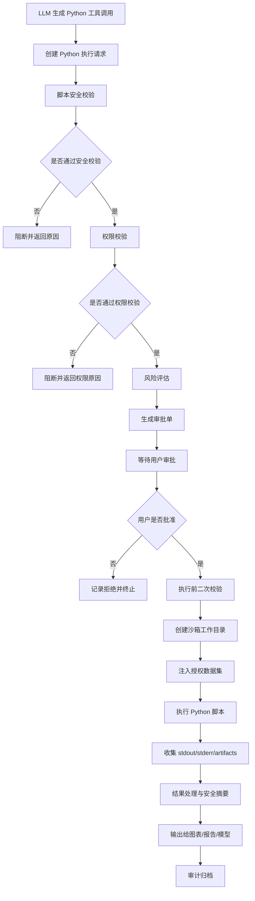

# Codex Goal 模式提示词：存续期数据探针智能体｜Python Runner 与沙箱策略模块开发

你现在是一个资深 TypeScript / Node.js / Electron / Python 沙箱 / AI Agent / 数据安全工程师。围绕项目 **“存续期数据探针智能体 / Cycle Data Intelligence Agent”** 开发一个可落地、可测试、可扩展的 **“Python Runner 与沙箱策略”** 模块。

本模块用于为智能体提供安全可控的 Python 数据分析与可视化执行能力：大模型根据用户需求和数据上下文推理生成 Python 脚本，但 Python 脚本不允许直接执行，必须先经过脚本安全校验、权限校验、风险评估和用户审批。审批通过后，系统在受限沙箱中执行 Python 脚本，并将执行结果用于数据分析报告、图表生成、可视化呈现或大模型结果总结。

---

## 1. 项目背景

项目名称：**存续期数据探针智能体 / Cycle Data Intelligence Agent**

项目面向银行贷款后续尽职调查、贷后管理、存续期风险监测、数据源探索、SQL 查询、Python 分析、图表生成、风险报告生成等业务场景。

当前模块为：

> **Python Runner 与沙箱策略模块 / Python Runner & Sandbox Policy**

模块核心目标：

1. 为大模型提供语义明确、参数清晰、schema 严格的 Python 脚本执行工具；
2. 大模型只负责根据用户需求生成候选 Python 分析脚本；
3. Python 脚本不允许立即执行；
4. 执行前必须经过安全校验、权限校验、风险评估和用户审批；
5. 审批通过后必须在受限沙箱环境中执行；
6. Python 执行结果主要用于数据分析报告中的可视化呈现；
7. Python 执行不能访问未授权数据、未授权路径、网络、系统命令、敏感文件或宿主环境；
8. Python 结果返回必须结构化、可审计、可追踪；
9. 优先遵守当前项目结构，不要大规模重构无关模块。

---

## 2. 模块职责边界

本模块负责：

* Python 工具定义；
* Python 工具描述提示词；
* Python 工具参数 schema；
* Python 工具调用解析；
* Python 分析请求创建；
* Python 脚本安全校验；
* Python 执行权限校验；
* Python 风险评估；
* Python 用户审批流程；
* Python 沙箱执行；
* 授权数据集注入；
* 执行结果收集；
* 图表产物收集；
* stdout / stderr 收集；
* 结果摘要与可视化产物描述；
* 审计日志；
* 错误处理。

本模块不负责：

* 大模型底层流式调用；
* SQL 查询审批与执行；
* 数据库连接管理；
* 数据源 Schema Context 构建；
* 前端图表渲染实现；
* 最终报告自然语言生成；
* 复杂工作流编排。

但本模块应预留接口，方便与以下模块集成：

* Streaming Model Adapter；
* Schema Context Injection；
* SQL Tool Invocation & Approval Workflow；
* Tool Registry；
* Chart Generation Tool；
* Agent Runtime；
* Electron IPC；
* Audit Log Service；
* Data Source Permission Service。

---

## 3. 推荐目录结构

请优先复用现有结构，不要重构无关模块。

---

## 4. 核心原则

请在实现中严格遵守以下原则：

### 4.1 模型不能直接执行 Python

* 大模型只能生成候选 Python 脚本；
* Python 脚本必须经过系统校验和用户审批后才能执行；
* 工具调用后默认创建执行请求，而不是立即运行脚本。

### 4.2 默认审批

* Python 执行默认需要用户审批；
* 即使脚本低风险，也应创建审批请求；
* 可预留自动审批策略，但默认关闭；
* 审批前需要展示脚本目的、输入数据集、预期输出、风险等级、权限校验结果和沙箱限制。

### 4.3 沙箱执行

* Python 脚本必须在受限沙箱环境中运行；
* 不允许访问宿主敏感目录；
* 不允许访问网络；
* 不允许执行系统命令；
* 不允许安装包；
* 不允许读取任意文件；
* 不允许写入任意路径；
* 只允许读取系统注入的授权数据集；
* 只允许写入沙箱指定的 `output/` 和 `artifacts/` 目录。

### 4.4 数据访问分层原则

* Python 不允许直接连接数据库；
* Python 不允许读取数据库连接串、数据库密码或数据库配置；
* Python 输入数据必须来自 SQL 工具输出、已审批数据集引用、CSV 临时数据集或受控上传文件副本；
* Python 仅处理“已授权、已裁剪、已脱敏或已审批”的数据集；
* 不允许 Python 绕过 SQL 工具、数据源权限和字段权限体系。

### 4.5 可视化产物受控

* Python 可以生成图表文件或结构化图表数据；
* 图表输出路径必须限定在沙箱 `artifacts/` 目录；
* 图表产物需要登记 artifact metadata；
* 图表结果用于报告展示，不应暴露未授权源数据。

### 4.6 可审计

* 脚本生成、审批、安全校验、权限校验、执行、失败、超时、取消、产物输出都必须记录审计事件；
* 审计日志不得记录 API Key、Token、数据库密码、连接串、敏感字段原始值或大规模源数据。

---

## 5. Python 工具设计

请设计并实现一个语义明确的工具。

### 5.1 工具名

推荐工具名：

```text
request_python_analysis_execution
```

不要使用过于宽泛的名称，例如：

* `run_python`
* `execute_code`
* `python`
* `analysis_tool`

工具名应明确表达：这是一个需要审批的 Python 分析执行请求。

---

## 6. 工具描述提示词

请在 `python-tool-prompt.ts` 中提供工具描述提示词，供 Tool Registry 或模型工具注入使用。

### 6.1 英文工具描述

```text
request_python_analysis_execution is a controlled Python data analysis execution request tool.

Use this tool only when the user asks for data analysis, statistical computation, data transformation, visualization preparation, chart generation, anomaly detection, trend analysis, correlation analysis, or report-ready analytical output that requires Python execution.

The model must provide a Python script, explain the purpose of the script, declare the required input datasets, and describe the expected outputs. The script will not be executed immediately. It will first be validated, checked against user permissions, assessed for risk, and submitted for user approval. Only approved scripts can be executed in a restricted sandbox.

All input data must come from approved dataset references, such as SQL execution results, controlled CSV temporary datasets, uploaded file copies, or derived datasets. The script must not directly connect to databases or access raw data sources.

Never use this tool to access the network, read arbitrary local files, write outside the sandbox directory, execute shell commands, install packages, access environment secrets, connect to databases directly, modify source data, or perform any unauthorized operation.
```

### 6.2 中文工具描述

```text
request_python_analysis_execution 是一个受控的 Python 数据分析执行请求工具。

仅当用户需求需要执行数据分析、统计计算、数据转换、可视化准备、图表生成、异常检测、趋势分析、相关性分析或报告级分析结果输出时，才使用该工具。

模型需要提供 Python 脚本，说明脚本目的，声明所需输入数据集，并描述预期输出。脚本不会被立即执行，而是先经过脚本安全校验、用户权限校验、风险评估和用户审批。只有审批通过的脚本才能在受限沙箱中执行。

所有输入数据必须来自已审批的数据集引用，例如 SQL 执行结果、受控 CSV 临时数据集、上传文件副本或派生数据集。Python 脚本不得直接连接数据库，不得访问原始业务数据源。

禁止使用该工具访问网络、读取任意本地文件、写入沙箱目录之外的路径、执行 shell 命令、安装依赖包、读取环境密钥、直接连接数据库、修改源数据或执行任何未授权操作。
```

---

## 7. 工具参数 Schema

请实现严格的工具参数类型和 JSON Schema。

### 7.1 TypeScript 类型

```ts
export type RequestPythonAnalysisExecutionInput = {
  script: string;
  purpose: string;
  inputDatasets: PythonInputDatasetRef[];
  expectedOutputs: PythonExpectedOutput[];
  resultUse: PythonResultUse;
  resultConsumer?: PythonResultConsumer;
  requiredLibraries?: string[];
  timeoutMs?: number;
  memoryLimitMb?: number;
  requireApproval?: boolean;
  approvalReason?: string;
  metadata?: Record<string, unknown>;
};
```

### 7.2 输入数据集引用

```ts
export type PythonInputDatasetRef = {
  datasetId: string;
  sourceType:
    | 'sql_execution_result'
    | 'csv_temp_table'
    | 'uploaded_file'
    | 'derived_dataset'
    | 'inline_preview';
  description?: string;
  schema?: Record<string, string>;
  rowCount?: number;
  columnCount?: number;
  accessMode?: 'read_only';
  sourceSqlRequestId?: string;
  sourceSqlExecutionId?: string;
  sensitivity?: 'public' | 'internal' | 'sensitive' | 'restricted';
};
```

### 7.3 预期输出

```ts
export type PythonExpectedOutput = {
  outputName: string;
  outputType:
    | 'table'
    | 'summary'
    | 'chart_image'
    | 'chart_spec'
    | 'json'
    | 'text'
    | 'file';
  description?: string;
};
```

### 7.4 枚举类型

```ts
export type PythonResultUse =
  | 'chart_generation'
  | 'statistical_analysis'
  | 'risk_report'
  | 'data_quality_report'
  | 'trend_analysis'
  | 'correlation_analysis'
  | 'anomaly_detection'
  | 'report_visualization'
  | 'debug';

export type PythonResultConsumer =
  | 'llm'
  | 'chart_tool'
  | 'agent_runtime'
  | 'user_preview'
  | 'report_generator';
```

### 7.5 JSON Schema 要求

请实现工具输入 schema，至少包含：

* `script`

  * required；
  * string；
  * 最小长度 1；
  * 最大长度可配置，例如 50000；
  * 禁止空脚本。

* `purpose`

  * required；
  * string；
  * 描述脚本用途；
  * 用于审批展示和审计。

* `inputDatasets`

  * required；
  * array；
  * 至少 1 个；
  * 每个 datasetId 必须是已授权数据引用；
  * 默认只读；
  * 不允许为空数组。

* `expectedOutputs`

  * required；
  * array；
  * 至少 1 个；
  * 声明脚本预期输出。

* `resultUse`

  * required；
  * enum；
  * 表示 Python 结果用途。

* `resultConsumer`

  * optional；
  * enum；
  * 表示执行结果将交给谁使用。

* `requiredLibraries`

  * optional；
  * string[]；
  * 仅允许白名单库；
  * 默认不允许安装新库。

* `timeoutMs`

  * optional；
  * number；
  * 不得超过系统配置。

* `memoryLimitMb`

  * optional；
  * number；
  * 不得超过系统配置。

* `requireApproval`

  * optional；
  * boolean；
  * 默认 true。

* `approvalReason`

  * optional；
  * string；
  * 用于说明为什么需要执行该 Python 分析。

工具参数中禁止出现：

* 数据库连接串；
* 数据库账号；
* 数据库密码；
* API Key；
* Token；
* 任意本地绝对路径；
* 未授权文件路径；
* 原始生产数据源连接信息。

---

## 8. 工具返回结果定义

请设计清晰的工具返回结果。

注意：工具调用后可能只是创建审批请求，并不一定立即执行 Python。

```ts
export type RequestPythonAnalysisExecutionOutput = {
  requestId: string;
  status: PythonExecutionRequestStatus;
  purpose: string;
  inputDatasets: PythonInputDatasetRef[];
  expectedOutputs: PythonExpectedOutput[];
  riskAssessment: PythonRiskAssessment;
  permissionCheck: PythonPermissionCheckResult;
  safetyCheck: PythonScriptSafetyCheckResult;
  approval: PythonApprovalState;
  execution?: PythonExecutionResult;
  message: string;
  createdAt: string;
};
```

### 8.1 请求状态

```ts
export type PythonExecutionRequestStatus =
  | 'draft'
  | 'blocked'
  | 'pending_approval'
  | 'approved'
  | 'rejected'
  | 'executing'
  | 'completed'
  | 'failed'
  | 'timeout'
  | 'cancelled'
  | 'expired';
```

### 8.2 执行结果

```ts
export type PythonExecutionResult = {
  executionId: string;
  requestId: string;
  status: 'success' | 'failed' | 'timeout' | 'cancelled';
  stdout: string;
  stderr: string;
  outputs: PythonExecutionOutput[];
  artifacts: PythonArtifact[];
  safeModelPayload?: PythonModelResultPayload;
  reportVisualizationPayload?: PythonReportVisualizationPayload;
  executionTimeMs: number;
  memoryUsedMb?: number;
  warnings: string[];
  createdAt: string;
};
```

### 8.3 输出产物

```ts
export type PythonArtifact = {
  artifactId: string;
  name: string;
  type: 'image' | 'csv' | 'json' | 'html' | 'text' | 'figure';
  mimeType?: string;
  path?: string;
  sizeBytes?: number;
  description?: string;
  createdAt: string;
};
```

### 8.4 PythonExecutionOutput

```ts
export type PythonExecutionOutput = {
  name: string;
  type: 'table' | 'summary' | 'chart_image' | 'chart_spec' | 'json' | 'text' | 'file';
  value?: unknown;
  artifactId?: string;
  description?: string;
};
```

---

## 9. Python 脚本安全校验

请实现 `PythonScriptValidator`。

### 9.1 必须拦截的行为

必须拦截或标记为高风险：

```text
网络访问：
- requests
- urllib
- http.client
- socket
- aiohttp
- websockets

系统命令：
- os.system
- subprocess
- popen
- shlex
- pty

文件系统高风险访问：
- open 读取未授权路径
- pathlib.Path 访问未授权路径
- shutil
- glob 大范围扫描
- tempfile 非沙箱目录
- 写入沙箱目录之外

动态执行：
- eval
- exec
- compile
- __import__
- importlib

环境与密钥：
- os.environ
- dotenv
- keyring
- 读取 .env
- 读取 SSH key
- 读取系统凭据

进程与系统：
- multiprocessing 高风险使用
- threading 可限制或标记
- signal
- ctypes
- resource 修改
- psutil

包管理：
- pip
- conda
- ensurepip
- pkg_resources 安装逻辑

数据库直连：
- sqlalchemy create_engine
- pymysql
- psycopg2
- mysql.connector
- sqlite3 连接未授权路径
- cx_Oracle
- pyodbc
- pandas.read_sql
- pandas.read_sql_query
- 任意数据库连接字符串
```

### 9.2 允许的典型库

默认白名单可以包括：

```text
pandas
numpy
matplotlib
math
statistics
json
csv
datetime
re
collections
itertools
scipy
sklearn
```

注意：

* `scipy`、`sklearn` 可配置是否允许；
* matplotlib 输出文件只能写入沙箱 `artifacts/` 目录；
* pandas 只能读取预先注入的数据集路径或内存数据引用；
* 不允许 pandas 任意读取本地文件路径；
* 不允许 pandas 直接读 SQL。

### 9.3 校验结果类型

```ts
export type PythonScriptSafetyCheckResult = {
  passed: boolean;
  level: 'safe' | 'warning' | 'blocked';
  issues: PythonScriptSafetyIssue[];
  detectedImports: string[];
  detectedOutputs: string[];
  usesFileSystem: boolean;
  usesNetwork: boolean;
  usesShell: boolean;
  usesDynamicExecution: boolean;
  usesDatabaseConnection: boolean;
};
```

```ts
export type PythonScriptSafetyIssue = {
  code: PythonScriptSafetyIssueCode;
  severity: 'info' | 'warning' | 'error' | 'critical';
  message: string;
  location?: string;
};
```

```ts
export type PythonScriptSafetyIssueCode =
  | 'FORBIDDEN_IMPORT'
  | 'FORBIDDEN_FUNCTION'
  | 'NETWORK_ACCESS'
  | 'SHELL_EXECUTION'
  | 'UNAUTHORIZED_FILE_ACCESS'
  | 'DYNAMIC_EXECUTION'
  | 'ENV_ACCESS'
  | 'PACKAGE_INSTALL'
  | 'DATABASE_DIRECT_CONNECTION'
  | 'UNBOUNDED_LOOP_RISK'
  | 'MEMORY_RISK'
  | 'UNSUPPORTED_SCRIPT'
  | 'PARSE_FAILED';
```

建议使用 Python AST 或 JS 侧静态扫描实现。当前版本可先用基础 AST/正则扫描，并预留更严格的沙箱策略。

---

## 10. 权限校验

请实现 `PythonPermissionValidator`。

### 10.1 权限维度

至少支持：

* 用户是否可执行 Python 分析；
* 用户是否可访问输入数据集；
* 用户是否可使用敏感字段；
* 用户是否可生成图表；
* 用户是否可生成文件产物；
* 用户是否可使用高级分析库；
* 用户是否可运行高风险脚本；
* 用户是否具备自动审批权限；
* 用户是否可将结果返回给大模型；
* 用户是否可将结果写入报告生成器。

### 10.2 权限上下文类型

```ts
export type PythonUserPermissionContext = {
  userId: string;
  roles: string[];
  allowPythonExecution: boolean;
  allowChartGeneration?: boolean;
  allowFileArtifacts?: boolean;
  allowSensitiveDataAnalysis?: boolean;
  allowAdvancedLibraries?: boolean;
  allowAutoApproval?: boolean;
  allowedDatasetIds: string[];
  deniedDatasetIds?: string[];
  approvalPolicy?: PythonApprovalPolicy;
};
```

### 10.3 权限校验结果

```ts
export type PythonPermissionCheckResult = {
  passed: boolean;
  reasons: PythonPermissionIssue[];
  allowedDatasets: string[];
  deniedDatasets: string[];
  requiresMasking: boolean;
  requiresApproval: boolean;
};
```

```ts
export type PythonPermissionIssue = {
  code:
    | 'PYTHON_EXECUTION_DENIED'
    | 'DATASET_ACCESS_DENIED'
    | 'SENSITIVE_DATA_DENIED'
    | 'CHART_GENERATION_DENIED'
    | 'FILE_ARTIFACT_DENIED'
    | 'ADVANCED_LIBRARY_DENIED'
    | 'AUTO_APPROVAL_DENIED';
  severity: 'info' | 'warning' | 'error' | 'critical';
  message: string;
};
```

---

## 11. 风险评估

请实现 `PythonRiskAssessor`。

### 11.1 风险等级

```ts
export type PythonRiskLevel = 'low' | 'medium' | 'high' | 'blocked';
```

### 11.2 风险因素

至少考虑：

* 是否涉及敏感数据；
* 是否使用高级分析库；
* 是否生成文件产物；
* 是否生成图表；
* 是否输入数据量较大；
* 是否脚本较长；
* 是否存在循环；
* 是否存在复杂计算；
* 是否存在文件读写；
* 是否存在高风险 import；
* 是否结果返回给大模型；
* 是否用于报告发布；
* 用户权限等级；
* 输入数据是否带有完整数据集引用；
* 输入数据是否超过阈值；
* 是否存在重复计算风险。

### 11.3 风险结果类型

```ts
export type PythonRiskAssessment = {
  riskLevel: PythonRiskLevel;
  score: number;
  reasons: string[];
  requiresApproval: boolean;
  requiresHigherPrivilege?: boolean;
  recommendedTimeoutMs: number;
  recommendedMemoryLimitMb: number;
  recommendedResultMode: PythonResultMode;
};
```

```ts
export type PythonResultMode =
  | 'summary_only'
  | 'artifact_only'
  | 'limited_table'
  | 'chart_payload'
  | 'blocked';
```

---

## 12. 审批流程

请实现 `PythonApprovalWorkflow`。

### 12.1 流程



### 12.2 审批状态

```ts
export type PythonApprovalState = {
  approvalId: string;
  status: 'not_required' | 'pending' | 'approved' | 'rejected' | 'expired';
  requestedBy: string;
  approvedBy?: string;
  rejectedBy?: string;
  reason?: string;
  riskLevel: PythonRiskLevel;
  createdAt: string;
  updatedAt?: string;
  expiresAt?: string;
};
```

### 12.3 审批动作

需要实现：

```ts
createPythonExecutionRequest(input, userContext)
getPythonExecutionRequest(requestId)
approvePythonExecutionRequest(requestId, userContext)
rejectPythonExecutionRequest(requestId, userContext, reason)
executeApprovedPythonRequest(requestId, userContext)
cancelPythonExecutionRequest(requestId, userContext)
```

### 12.4 审批展示信息

审批单应包含：

* Python 脚本用途；
* Python 脚本内容；
* 输入数据集；
* 输入数据量；
* 风险等级；
* 风险原因；
* 是否生成图表；
* 是否返回给大模型；
* 超时时间；
* 内存限制；

---

## 13. 客户端沙箱策略

请实现 `PythonSandboxPolicy` 和 `PythonRunnerAdapter`。

### 13.1 P0 沙箱运行方式

当前版本优先实现本地受限子进程执行：

* Node.js 启动 Python 子进程；
* 使用临时工作目录；
* 注入受控输入数据；
* 限制 timeout；
* 限制 stdout/stderr 大小；
* 限制输出文件目录；
* 禁止传入敏感环境变量；
* 使用静态校验拦截危险代码；
* 使用执行前二次校验；
* 资源监控；
* 并发限制；
* 独立 runner 进程；
* Electron 主进程隔离；
* 执行熔断。
* 支持任务取消预留接口。

### 13.2 后续扩展预留

预留接口支持：

* Docker 容器沙箱；
* Pyodide / WebAssembly；

当前实现不要求完成容器或 WASM 沙箱，但接口设计需可扩展。

### 13.3 沙箱目录结构

每次执行创建独立工作目录：

```text
sandbox/
  runs/
    {executionId}/
      input/
      output/
      artifacts/
      script.py
      metadata.json
      stdout.log
      stderr.log
```

规则：

* Python 脚本只能读取 `input/`；
* Python 脚本只能写入 `output/` 和 `artifacts/`；
* 不允许访问项目源码目录、用户主目录、系统目录；
* 执行完成后可按配置清理临时目录；
* artifact metadata 需要保留。

### 13.4 环境变量策略

默认仅注入必要环境变量：

```text
PYTHONUNBUFFERED=1
MPLBACKEND=Agg
CYCLE_PROBE_SANDBOX=1
```

禁止注入：

* API Key；
* 数据库密码；
* 用户 Token；
* 系统凭据；
* `.env` 内容；
* 生产环境连接串。

### 13.5 资源限制

必须支持：

* 执行超时；
* stdout/stderr 最大长度；
* 输出文件最大数量；
* 单个输出文件最大大小；
* artifact 总大小限制；
* 内存限制，P0 可配置并预留实现；
* 进程取消，P0 可预留；
* 执行失败清理。

---

## 14. Python Runner 执行器

请实现 `PythonRunner`。

### 14.1 执行前检查

执行 Python 前必须再次校验：

* 请求状态必须为 `approved`；
* 审批未过期；
* 用户权限仍有效；
* 脚本安全校验仍通过；
* 输入数据集仍可访问；
* 沙箱目录创建成功；
* 未触发全局执行限制，当前可预留；
* 未超过并发和频率限制，当前可预留。

### 14.2 数据注入方式

输入数据集可以通过以下方式注入沙箱：

* CSV 文件副本；
* JSONL 文件；
* Parquet 文件，当前可预留；
* SQL 查询结果导出的受控文件；
* 内存缓存 materialize 后写入 input 目录；
* SQLite 临时结果库只读副本，当前可预留。

建议 P0 支持 CSV / JSONL 注入。

Python 脚本中应通过约定路径读取数据，例如：

```python
import pandas as pd

df = pd.read_csv("input/dataset_1.csv")
```

禁止 Python 脚本自行访问任意路径。

### 14.3 图表输出方式

推荐脚本将图表输出到：

```python
import matplotlib.pyplot as plt

plt.savefig("artifacts/chart_1.png", dpi=160, bbox_inches="tight")
```

系统收集 artifacts 并生成 metadata。

---

## 15. 执行结果处理

请实现 `PythonResultProcessor` 和 `PythonArtifactManager`。

### 15.1 结果用途：数据分析报告可视化

当结果用于报告可视化时，应生成：

```ts
export type PythonReportVisualizationPayload = {
  executionId: string;
  purpose: string;
  artifacts: PythonArtifact[];
  charts: PythonChartOutput[];
  summary: string;
  limitations: string[];
  warnings: string[];
};
```

```ts
export type PythonChartOutput = {
  chartId: string;
  title?: string;
  description?: string;
  artifactId?: string;
  type: 'image' | 'json_spec' | 'html';
  mimeType?: string;
};
```

### 15.2 返回给大模型的安全结果

当结果需要返回给大模型时，应生成：

```ts
export type PythonModelResultPayload = {
  executionId: string;
  purpose: string;
  textSummary: string;
  outputDescriptions: Array<{
    name: string;
    type: string;
    description: string;
  }>;
  artifactSummaries: Array<{
    artifactId: string;
    type: string;
    description?: string;
  }>;
  limitations: string[];
  warnings: string[];
};
```

要求：

* 不将大规模中间数据直接返回给模型；
* 不返回未脱敏敏感字段原值；
* 不返回本地绝对路径，除非是内部受控 artifact reference；
* 不返回完整 stdout 中可能包含的数据泄露内容，需截断；
* stderr 可摘要化；
* 对图表产物仅返回 artifactId、类型、说明和可控引用。

---

## 16. 审计日志

请实现 `PythonAuditLogger` 或审计扩展点。

至少记录：

* Python 请求创建；
* 脚本安全校验通过/失败；
* 权限校验通过/失败；
* 风险评估；
* 审批单创建；
* 用户审批通过；
* 用户拒绝；
* Python 开始执行；
* Python 执行成功；
* Python 执行失败；
* Python 超时；
* Python 被取消；
* artifact 生成；
* 结果输出给报告生成器；
* 结果输出给大模型；
* 高风险脚本被阻断。

审计字段建议：

```ts
export type PythonAuditEvent = {
  auditId: string;
  eventType: PythonAuditEventType;
  requestId?: string;
  executionId?: string;
  userId: string;
  scriptHash?: string;
  riskLevel?: PythonRiskLevel;
  status: 'success' | 'failed' | 'blocked';
  message: string;
  metadata?: Record<string, unknown>;
  createdAt: string;
};
```

注意：

* 审计日志中可以存 script hash；
* 是否存明文脚本由配置决定；
* 不允许记录密钥、Token、数据库密码；
* 不允许记录大量原始数据。

---

## 17. 对外 API 设计

请实现清晰的 TypeScript API。

建议暴露：

```ts
createPythonRunnerModule(config)

pythonRunnerTool.getToolDefinition()

pythonRunnerTool.createExecutionRequest(input, userContext)

pythonRunnerTool.getExecutionRequest(requestId)

pythonRunnerTool.approveExecutionRequest(requestId, userContext)

pythonRunnerTool.rejectExecutionRequest(requestId, userContext, reason)

pythonRunnerTool.executeApprovedRequest(requestId, userContext)

pythonRunnerTool.cancelExecutionRequest(requestId, userContext)

pythonRunnerTool.validateScript(input, userContext)

pythonRunnerTool.assessRisk(input, userContext)

pythonRunnerTool.processResult(result, options)
```

### 17.1 模块配置

```ts
export type PythonRunnerModuleConfig = {
  defaultTimeoutMs: number;
  hardTimeoutMs: number;
  defaultMemoryLimitMb: number;
  hardMemoryLimitMb: number;
  maxStdoutBytes: number;
  maxStderrBytes: number;
  maxArtifactCount: number;
  maxArtifactSizeBytes: number;
  requireApprovalByDefault: boolean;
  allowAutoApprovalForLowRisk?: boolean;
  storePlainScriptInAuditLog?: boolean;
  allowedLibraries: string[];
  sandboxRootDir: string;
  pythonExecutable?: string;
  datasetResolver: PythonDatasetResolver;
  permissionProvider: PythonPermissionProvider;
  auditLogger?: PythonAuditLogger;
};
```

### 17.2 DatasetResolver 接口

```ts
export type PythonDatasetResolver = {
  resolveDataset(datasetId: string): Promise<{
    datasetId: string;
    name: string;
    sourceType: PythonInputDatasetRef['sourceType'];
    schema?: Record<string, string>;
    rowCount?: number;
    columnCount?: number;
    sensitivity?: 'public' | 'internal' | 'sensitive' | 'restricted';
    materializeForSandbox: (input: {
      targetDir: string;
      format: 'csv' | 'jsonl';
    }) => Promise<{
      fileName: string;
      relativePath: string;
      rowCount?: number;
      columnCount?: number;
    }>;
  } | null>;
};
```

### 17.3 PermissionProvider 接口

```ts
export type PythonPermissionProvider = {
  getPermissionContext(userId: string): Promise<PythonUserPermissionContext>;
};
```

---

## 18. 错误处理

请设计统一错误类型。

```ts
export type PythonRunnerErrorCode =
  | 'PYTHON_SCRIPT_EMPTY'
  | 'PYTHON_SCRIPT_PARSE_FAILED'
  | 'PYTHON_FORBIDDEN_IMPORT'
  | 'PYTHON_FORBIDDEN_FUNCTION'
  | 'PYTHON_NETWORK_ACCESS_DENIED'
  | 'PYTHON_SHELL_EXECUTION_DENIED'
  | 'PYTHON_FILE_ACCESS_DENIED'
  | 'PYTHON_ENV_ACCESS_DENIED'
  | 'PYTHON_DATABASE_DIRECT_CONNECTION_DENIED'
  | 'PYTHON_DATASET_NOT_FOUND'
  | 'PYTHON_DATASET_PERMISSION_DENIED'
  | 'PYTHON_APPROVAL_REQUIRED'
  | 'PYTHON_APPROVAL_NOT_FOUND'
  | 'PYTHON_APPROVAL_REJECTED'
  | 'PYTHON_APPROVAL_EXPIRED'
  | 'PYTHON_REQUEST_NOT_APPROVED'
  | 'PYTHON_SANDBOX_CREATE_FAILED'
  | 'PYTHON_EXECUTION_FAILED'
  | 'PYTHON_EXECUTION_TIMEOUT'
  | 'PYTHON_EXECUTION_CANCELLED'
  | 'PYTHON_ARTIFACT_TOO_LARGE'
  | 'PYTHON_RESULT_PROCESS_FAILED'
  | 'UNKNOWN_ERROR';
```

要求：

* 所有错误都要结构化；
* 不暴露本地敏感路径；
* 不暴露数据库密码、Token、API Key；
* 脚本安全拦截要明确说明原因；
* 权限拒绝要明确说明权限维度；
* 审批失败要明确说明状态；
* 执行失败要保留 requestId / executionId。

---

## 19. 测试要求

请补充测试用例。优先使用 Vitest。如果项目已有测试框架，请遵守现有测试框架。

### 19.1 Tool Definition 测试

覆盖：

* 工具名正确；
* 工具描述包含审批和沙箱约束；
* 工具描述包含禁止数据库直连约束；
* 参数 schema required 正确；
* enum 值正确；
* 返回结果结构正确；
* 禁止操作说明明确。

### 19.2 Script Validator 测试

覆盖：

* 允许 pandas / numpy / matplotlib；
* 拒绝 requests；
* 拒绝 socket；
* 拒绝 os.system；
* 拒绝 subprocess；
* 拒绝 eval；
* 拒绝 exec；
* 拒绝 **import**；
* 拒绝 os.environ；
* 拒绝 open 访问绝对路径；
* 拒绝 pip / conda；
* 拒绝 sqlalchemy / pymysql / psycopg2；
* 拒绝 pandas.read_sql；
* 拒绝数据库连接字符串；
* 识别 matplotlib 保存图表；
* 识别可能无限循环，当前可基础实现；
* 解析失败返回结构化错误。

### 19.3 Permission Validator 测试

覆盖：

* 用户有 Python 执行权限；
* 用户无 Python 执行权限；
* 用户有数据集权限；
* 用户无数据集权限；
* 敏感数据分析权限；
* 图表生成权限；
* 文件 artifact 权限；
* 自动审批权限。

### 19.4 Approval Workflow 测试

覆盖：

* 创建审批请求；
* 安全校验失败进入 blocked；
* 权限校验失败进入 blocked；
* 安全和权限通过进入 pending_approval；
* 用户批准；
* 用户拒绝；
* 审批过期；
* 未审批不能执行；
* 审批后可执行；
* 执行前二次校验失败；
* 取消请求。

### 19.5 Sandbox Policy 测试

覆盖：

* 创建独立沙箱目录；
* 创建 input/output/artifacts 子目录；
* 注入安全环境变量；
* 不注入敏感环境变量；
* 输出路径限制；
* artifact 数量限制；
* artifact 大小限制；
* stdout/stderr 截断。

### 19.6 Runner 测试

覆盖：

* 执行简单 Python 脚本；
* 读取授权 CSV；
* 生成 matplotlib 图表；
* 收集 stdout；
* 收集 stderr；
* 收集 artifacts；
* 执行超时；
* 执行失败；
* 结果 payload 生成；
* 不返回绝对路径给模型；
* 不允许访问沙箱外路径。

---

## 20. 实现约束

请遵守以下约束：

1. 优先使用 TypeScript；
2. 保持模块可独立测试；
3. 不要依赖具体 UI；
4. 不要直接连接真实生产数据库；
5. 不允许 Python 脚本自行连接数据库；
6. 不允许 Python 脚本访问网络；
7. 不允许 Python 脚本执行 shell 命令；
8. 不允许 Python 脚本读取任意本地文件；
9. 不允许绕过审批流程；
10. 不允许把完整敏感数据直接输入给大模型；
11. 所有 Python 执行必须通过 `PythonRunnerAdapter`；
12. 所有输入数据必须通过 `PythonDatasetResolver` 授权 materialize；
13. 敏感字段默认脱敏或受控；
14. artifact 输出必须登记 metadata；
15. 审批和执行必须记录审计事件；
16. 所有公开 API 应从 `index.ts` 导出；
17. 如果项目已有 lint / format / test 规范，请遵守；
18. 优先遵守当前项目结构，不要大规模重构无关模块；
19. 如发现已有 `model-adapter`、`schema-context`、`sql-tool`、`tool-registry`、`data-source`、`audit` 模块，请复用其类型与接口；
20. 完成后运行类型检查和测试，如环境允许。

---

## 21. 验收标准

完成后应满足以下标准：

1. 可以向 Agent Tool Registry 注入 `request_python_analysis_execution` 工具定义；
2. 工具描述能明确约束模型生成 Python 分析脚本而不是直接执行；
3. 工具参数 schema 清晰、严格；
4. 模型生成 Python 后不会立即执行，而是创建执行请求；
5. 高风险脚本会被安全拦截；
6. 用户无权限的数据集不能执行；
7. Python 执行前必须审批；
8. 审批拒绝或过期时不能执行；
9. 审批通过后执行前会进行二次校验；
10. Python 在独立沙箱工作目录中执行；
11. Python 不能访问网络、shell、未授权文件、环境密钥或数据库直连；
12. Python 可以读取授权数据集副本；
13. Python 可以生成图表 artifact；
14. 结果支持生成 `PythonReportVisualizationPayload`；
15. 结果支持生成 `PythonModelResultPayload`；
16. 返回给模型的 payload 不包含完整敏感源数据；
17. 所有关键动作可审计；
18. 有基础测试覆盖；
19. 模块可与 Streaming Model Adapter、Schema Context Injection、SQL Tool、Chart Tool、Agent Runtime 对接。

---

## 22. 开发优先级

请按以下优先级实现。

### P0：必须完成

* 类型定义；
* Python 工具定义；
* 工具描述提示词；
* JSON Schema；
* Script Validator 基础实现；
* Permission Validator 基础实现；
* Risk Assessor 基础实现；
* Approval Workflow 内存实现；
* PythonSandboxPolicy；
* PythonRunnerAdapter 接口；
* 本地子进程 PythonRunner；
* DatasetResolver 接口；
* ArtifactManager；
* ResultProcessor；
* PythonReportVisualizationPayload；
* PythonModelResultPayload；
* Audit Logger 接口；
* artifact 大小限制；
* stdout/stderr 截断；
* 运行 timeout；
* 沙箱目录清理策略；
* 审批流 UI 状态；
* 资源监控；
* 并发限制；
* 运行熔断；
* 基础测试。

### P1：预留接口

* Docker 沙箱；
* Pyodide / WASM 沙箱；
* 生产级安全策略；
* Electron IPC；
* artifact 持久化；
* 与 Agent Runtime 状态机联动。

---

## 23. 请最终输出

执行完成后，请输出：

1. 新增或修改的文件列表；
2. 核心 API 使用示例；
3. Python 工具定义示例；
4. 大模型工具调用参数示例；
5. 创建 Python 审批请求示例；
6. 审批通过并执行 Python 示例；
7. 图表 artifact 输出示例；
8. 报告可视化 payload 示例；
9. 安全返回给大模型的 payload 示例；
10. 测试运行结果；
11. 尚未完成或需要后续补充的事项。

请直接推进实现，不要停留在设计文档。请优先遵守当前仓库目录结构，不要大规模重构无关模块；如发现已有 `model-adapter`、`schema-context`、`sql-tool`、`tool-registry`、`data-source`、`audit` 模块，请复用其类型与接口。
