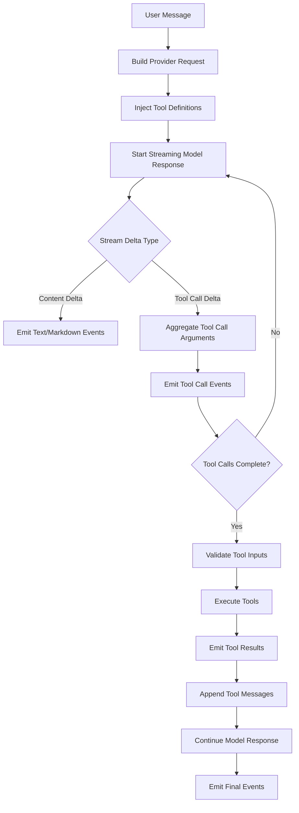

# Codex Goal 模式提示词：存续期数据探针智能体｜流式模型调用适配器模块开发

你现在是一个资深 TypeScript / Node.js / Electron / AI Agent 工程师。请围绕项目 **“存续期数据探针智能体”** 开发一个可落地、可测试、可扩展的 **“流式模型调用适配器”** 模块。

本模块用于统一封装大模型流式调用、Markdown 流式渲染、多工具调用、工具注入、工具调用解析、工具结果回传、会话版本管理等能力，作为后续智能体能力的底层模型调用基础设施。

---

## 1. 项目背景

项目名称：**存续期数据探针智能体**

项目面向银行贷款后续尽职调查、贷后管理、存续期风险监测、数据源探索、数据库 Compass、Schema 理解、SQL 生成与安全执行、存续期风险分析报告生成等场景。

本次开发模块为：

> **流式模型调用适配器 / Streaming Model Adapter**

它不是一个简单的 `fetch` 封装，而是后续智能体运行时的重要基础模块，需要支持：

1. 文本与 Markdown 内容的稳定流式输出；
2. Markdown 中复杂内容块的增量解析；
3. 多工具调用；
4. 工具结果回传；
5. 多轮会话；
6. 同一会话中的 Markdown 多版本生成、对比和选择；
7. 可审计、可测试、可接入 Electron 桌面客户端。

---

## 2. 技术目标

请直接开始实现，不要只输出方案。

请根据当前项目结构自行判断应放置的目录。

---

## 3. 核心功能要求

### 3.1 支持流式输出

模块需要支持从模型接口接收流式内容，并向上层输出统一事件。

需要支持的输出内容类型包括：

* `text`
* `markdown`

Markdown 内容需要支持增量输出，并能识别常见结构：

* 普通文字；
* 标题；
* 段落；
* 列表；
* 有序列表；
* 引用块；
* 行内代码；
* 代码块；
* Mermaid 代码块；
* 数学公式；
* 表格；
* 分割线；
* 链接；
* 加粗；
* 斜体。

注意：不要求在流式过程中完整渲染 Markdown UI，但需要提供稳定的结构化事件，方便前端逐步渲染。

---

### 3.2 统一流式事件协议

请设计并实现统一事件类型，例如：

```ts
export type ModelStreamEvent =
  | StreamStartEvent
  | TextDeltaEvent
  | MarkdownDeltaEvent
  | MarkdownBlockStartEvent
  | MarkdownBlockDeltaEvent
  | MarkdownBlockEndEvent
  | ToolCallStartEvent
  | ToolCallDeltaEvent
  | ToolCallEndEvent
  | ToolExecutionStartEvent
  | ToolExecutionResultEvent
  | ToolExecutionErrorEvent
  | VersionCreatedEvent
  | VersionUpdatedEvent
  | StreamEndEvent
  | StreamErrorEvent;
```

事件至少应覆盖：

* 流开始；
* 文本增量；
* Markdown 增量；
* Markdown 块开始；
* Markdown 块更新；
* Markdown 块结束；
* 工具调用开始；
* 工具调用参数增量；
* 工具调用结束；
* 工具执行开始；
* 工具执行成功；
* 工具执行失败；
* 版本创建；
* 版本更新；
* 流结束；
* 错误事件。

每个事件都应包含：

* `eventId`
* `type`
* `conversationId`
* `messageId`
* `createdAt`
* `payload`

可选包含：

* `traceId`
* `parentEventId`
* `provider`
* `model`
* `versionId`
* `toolCallId`
* `blockId`

---

### 3.3 支持 Markdown 流式块解析

请实现一个轻量 Markdown 流式解析器，不要求完整替代 Markdown AST 引擎，但需要支持识别基础块类型。

需要识别：

```ts
type MarkdownBlockType =
  | 'paragraph'
  | 'heading'
  | 'blockquote'
  | 'unordered_list'
  | 'ordered_list'
  | 'code_block'
  | 'mermaid'
  | 'math_block'
  | 'table'
  | 'horizontal_rule'
  | 'unknown';
```

要求：

1. 支持增量输入 chunk；

2. 能识别代码块开始和结束；

3. 能识别 Mermaid 代码块，例如：

   ````markdown
   ```mermaid
   graph TD
     A --> B
   ````

   ```
   ```

4. 能识别普通代码块，例如：

   ````markdown
   ```ts
   const a = 1
   ````

   ```
   ```

5. 能识别数学公式块，例如：

   ```markdown
   $$
   E = mc^2
   $$
   ```

6. 能识别表格块；

7. 能在流结束时 flush 未完成块；

8. 不要因为半截 Markdown chunk 导致解析崩溃；

9. 对未闭合代码块、未闭合公式块要能安全收尾；

10. 保留原始 Markdown 内容，方便前端 fallback 渲染。

---

### 3.4 支持工具调用

模块需要支持工具注入和工具调用执行。

工具定义结构建议：

```ts
export type ToolDefinition<TInput = unknown, TOutput = unknown> = {
  name: string;
  description: string;
  inputSchema: JSONSchema;
  riskLevel?: 'low' | 'medium' | 'high';
  timeoutMs?: number;
  handler: (input: TInput, context: ToolExecutionContext) => Promise<TOutput>;
};
```

需要实现：

* 工具注册；
* 工具列表导出为模型 provider 所需格式；
* 工具名称校验；
* 工具参数 schema 校验；
* 工具调用解析；
* 工具调用参数增量合并；
* 多工具调用；
* 并行或串行执行策略；
* 工具执行超时；
* 工具执行错误捕获；
* 工具结果结构化返回；
* 工具结果再次发送给模型；
* 工具调用审计扩展点。

---

### 3.5 多工具调用场景

需要重点支持模型在一次响应中产生多个工具调用。

例如：

```text
用户：分析客户 A 的贷后风险情况

模型可能调用：
1. searchCustomer
2. getLoanContracts
3. getRepaymentRecords
4. getCollateralInfo
5. getExternalRiskEvents
```

模块需要支持：

* 一个 assistant message 中多个 tool calls；
* 多个工具调用参数同时流式输出；
* 按 `toolCallId` 聚合参数；
* 工具调用完成后统一执行；
* 可配置执行策略：

```ts
type ToolExecutionMode = 'serial' | 'parallel';
```

* 支持工具依赖关系预留；
* 某个工具失败时不影响其他工具的可控执行；
* 支持将多个工具结果重新汇总发送给模型；
* 支持工具执行日志。

---

### 3.6 支持 OpenAI-Compatible Provider

请优先实现一个 OpenAI-Compatible Provider，优先遵守已实现`siliconflow` API设计。

要求支持兼容以下形式的接口：

* OpenAI Chat Completions 风格，如`siliconflow`；
* 支持 `stream: true`；
* 支持 `tools`；
* 支持 `tool_calls`；
* 支持多轮 messages；
* 支持模型名称配置；
* 支持 baseURL；
* 支持 apiKey；
* 支持 abort signal；
* 支持 timeout；
* 支持流式 SSE 解析；


请尽量不要把逻辑写死为 OpenAI 官方接口，应该兼容 SiliconFlow、Qwen、DeepSeek、OpenRouter、自建网关等 OpenAI-compatible 服务。

---

### 3.7 支持会话与消息结构

请设计基础会话与消息类型,优先遵守仓库内已有实现。

建议：

```ts
export type ConversationMessage = {
  id: string;
  role: 'system' | 'user' | 'assistant' | 'tool';
  content: string;
  toolCallId?: string;
  toolName?: string;
  createdAt: string;
  metadata?: Record<string, unknown>;
};
```

要求支持：

* system prompt；
* user message；
* assistant message；
* tool message；
* 多轮上下文；
* conversationId；
* messageId；
* traceId；
* 版本关联；
* provider metadata。

---

### 3.8 Markdown 多版本管理

模块需要支持在一次会话中通过多轮提示词生成多个 Markdown 版本，便于用户对比和选择。

典型场景：

```text
用户：生成一份存续期风险分析报告
模型生成：版本 v1

用户：更正式一点
模型生成：版本 v2

用户：增加表格和 Mermaid 流程图
模型生成：版本 v3

用户：对比 v2 和 v3，选择 v3 作为最终版本
```

需要实现版本管理器，支持：

* 创建版本；
* 更新版本；
* 版本状态；
* 设置当前版本；
* 设置最终选中版本；
* 获取版本列表；
* 获取指定版本内容；
* 比较两个版本；
* 根据版本继续生成；
* 保存版本元数据；
* 版本来源追踪。

版本类型建议：

```ts
export type ContentVersion = {
  versionId: string;
  conversationId: string;
  messageId: string;
  parentVersionId?: string;
  title?: string;
  contentType: 'markdown' | 'text';
  content: string;
  status: 'draft' | 'selected' | 'archived';
  createdAt: string;
  updatedAt: string;
  createdByPrompt?: string;
  metadata?: Record<string, unknown>;
};
```

版本比较可以先实现轻量 diff：

* 按行比较；
* 输出新增行；
* 输出删除行；
* 输出未变更行；
* 不需要复杂可视化 UI；
* 返回结构化 diff 数据。

---

## 4. 对外 API 设计要求

请实现清晰的 TypeScript API。

建议暴露：

```ts
createStreamingModelAdapter(config)
adapter.streamChat(input)
adapter.registerTool(tool)
adapter.unregisterTool(toolName)
adapter.getTools()
adapter.createVersion(input)
adapter.updateVersion(input)
adapter.listVersions(conversationId)
adapter.getVersion(versionId)
adapter.compareVersions(versionAId, versionBId)
```

`streamChat` 建议返回：

```ts
AsyncGenerator<ModelStreamEvent>
```

或兼容 Node.js stream 的形式。

优先推荐使用 `AsyncGenerator<ModelStreamEvent>`，方便 Electron 主进程、Node 服务和前端桥接。

---

## 5. 工具调用执行流程

请实现或预留以下流程：



请在代码中尽量体现这个流程。

---

## 6. 错误处理要求

请设计统一错误类型。

至少包括：

```ts
type ModelAdapterErrorCode =
  | 'PROVIDER_REQUEST_FAILED'
  | 'PROVIDER_STREAM_PARSE_FAILED'
  | 'PROVIDER_TIMEOUT'
  | 'USER_ABORTED'
  | 'TOOL_NOT_FOUND'
  | 'TOOL_INPUT_INVALID'
  | 'TOOL_EXECUTION_FAILED'
  | 'TOOL_EXECUTION_TIMEOUT'
  | 'MARKDOWN_PARSE_FAILED'
  | 'VERSION_NOT_FOUND'
  | 'VERSION_CONFLICT'
  | 'UNKNOWN_ERROR';
```

要求：

* Provider 请求失败要返回结构化错误；
* SSE 解析失败不能导致进程崩溃；
* 工具失败要能生成 ToolExecutionErrorEvent；
* 工具超时要能中断；
* 用户 abort 要能正确结束；
* 流结束时要能 flush Markdown parser；
* 所有错误事件应包含可读 message 和原始 cause；
* 不要暴露 apiKey、密码等敏感信息。

---

## 7. 测试要求

请补充测试用例。

至少覆盖：

### 7.1 Markdown Parser 测试

* 普通段落；
* 标题；
* 列表；
* 引用；
* 代码块；
* Mermaid 代码块；
* 数学公式块；
* 表格；
* 分块输入；
* 未闭合代码块；
* 未闭合数学公式；
* 流结束 flush。

### 7.2 Tool Call Parser 测试

* 单工具调用；
* 多工具调用；
* 工具参数分块；
* JSON 参数不完整；
* 工具名不存在；
* 参数 schema 校验失败；
* 多工具并行执行；
* 工具执行失败；
* 工具执行超时。

### 7.3 Version Manager 测试

* 创建版本；
* 更新版本；
* 获取版本；
* 列出版本；
* 设置选中版本；
* 比较版本；
* 父版本链；
* 版本不存在错误。

### 7.4 Streaming Adapter 测试

* 普通文本流；
* Markdown 流；
* 工具调用流；
* 多工具调用流；
* 工具结果回传后继续生成；
* provider stream 解析异常；
* abort；
* timeout；
* stream end flush。

如当前项目尚未配置测试框架，请根据现有技术栈选择合适测试方式；TypeScript 项目优先使用 Vitest。

---

## 8. 实现约束

请遵守以下约束：

1. 优先使用 TypeScript；
2. 保持模块可独立测试；
3. 不要将 provider 与业务逻辑强耦合；
4. 不要把工具定义写死在 adapter 内；
5. 不要直接依赖具体 UI；
6. 不要在日志或错误中暴露 apiKey、密码、Token；
7. 工具调用结果必须结构化；
8. Markdown 解析器要容错；
9. 多工具调用要按 `toolCallId` 聚合；
10. 版本管理先可使用内存实现，但接口需要方便后续替换为数据库持久化；
11. 代码要有必要注释；
12. 尽量使用明确类型，避免滥用 `any`；
13. 所有公开 API 应从 `index.ts` 导出；
14. 如果项目已有 lint / format / test 规范，请遵守；
15. 完成后运行类型检查和测试，如环境允许。

---

## 9. 验收标准

完成后应满足以下标准：

1. 可以通过统一 API 发起流式模型调用；
2. 可以接收并输出 `text` / `markdown` 流式事件；
3. 可以识别 Markdown 基础块；
4. 可以处理 Mermaid、代码块、数学公式块；
5. 可以注册工具并注入模型请求；
6. 可以解析单工具和多工具调用；
7. 可以执行工具并返回工具结果；
8. 可以在工具结果返回后继续模型生成流程；
9. 可以创建、更新、列出、比较 Markdown 版本；
10. 具备结构化错误处理；
11. 具备基础测试用例；
12. 公开 API 类型清晰；
13. 不暴露敏感信息；
14. 模块可以作为后续智能体运行时基础组件。

---

## 10. 开发优先级

请按以下优先级实现。

### P0：必须完成

* 类型定义；
* OpenAI-compatible Provider；
* SSE 流式解析；
* 统一事件协议；
* 文本 / Markdown delta 输出；
* Markdown 基础块解析；
* 工具注册；
* 工具调用解析；
* 单工具调用执行；
* 多工具调用聚合；
* 版本管理内存实现；
* 基础测试。
* 工具超时；
* abort signal；
* provider timeout；
* 工具输入 schema 校验；

### P1：预留接口
* 多工具并行 / 串行执行策略；
* 工具结果回传后继续生成；
* 数据库持久化版本管理；
* 审计日志；

---

## 11. 请最终输出

执行完成后，请输出：

1. 新增或修改的文件列表；
2. 核心 API 使用示例；
3. 工具注册与调用示例；
4. Markdown 版本管理示例；
5. 测试运行结果；
6. 尚未完成或需要后续补充的事项。

请直接推进实现，不要停留在设计文档。

请优先遵守当前仓库目录结构、字段定义、API设计，不要重构无关模块。

## 上下文

该子任务属于【数据助手】中的一部分。
