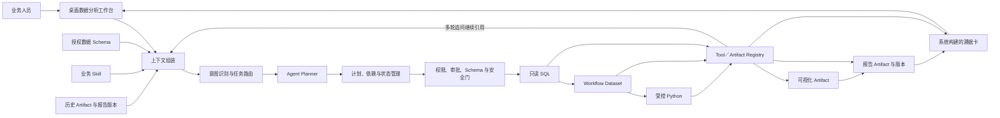

# “数智领航”黑客松参赛项目设计方案

## 一、项目概览与报名摘要

### 1.1 项目基本信息

| 项目 | 内容 |
|---|---|
| 项目名称 | 溯据 |
| 项目副标题 | 银行存续期可追溯数据分析智能体 |
| 参赛赛道 | AI 原生研发能力攻关赛道 |
| 赛事主题 | 战训结合，以赛孵产 |
| 聚焦场景 | 银行存续期数据查询、探索分析与动态报告生成 |
| 目标用户 | 贷后管理人员、后续尽职调查人员、业务分析人员、风险复核人员 |
| 团队构成 | 2 人：Agent 研发工程师 1 名、存续期业务项目主管 1 名 |
| 比赛周期 | 2 周，8 月 7 日截止 |
| 提交物 | 现场 Demo、PPT、演示视频、代码库 |

### 1.2 报名摘要

“溯据”是一款面向银行存续期管理的可验证、可对话数据分析智能体。业务人员只需使用自然语言提出问题和连续追问，无需手工编写 SQL、Python 脚本，即可完成数据查询、统计分析、图表生成和报告编制。

系统以 Agent 理解业务意图并规划任务，以受控 SQL/Python 工具执行真实数据计算，以 Artifact 保存数据集、分析结果、图表和报告版本，并通过“溯据卡”记录数据来源、筛选条件、统计口径、执行过程及上下游依赖。用户可以在上一轮结果上调整时间范围、筛选条件和分析维度，系统复用已有 Artifact，动态生成新的分析和报告版本。

项目不替代业务人员作风险判断，而是降低分析门槛、缩短数据作业链路，并让每项结果可复核、可引用、可审计。

### 1.3 一句话定位

> 溯据是面向银行存续期的可验证、可对话数据分析智能体，让业务人员不写 SQL 和 Python，也能通过多轮对话完成分析并生成有依据的动态报告。

### 1.4 三句记忆点

1. **业务人员负责提出问题，不再负责手写 SQL 和 Python。**
2. **报告不是一次生成的终点，而是随多轮业务追问持续演进的分析资产。**
3. **模型负责理解，工具负责执行，Artifact 负责证明，人负责决策。**

## 二、业务背景与核心痛点

### 2.1 业务背景

贷款发放后至结清、额度终止或风险处置完成前，银行需要持续开展存续期管理。业务人员需要整理客户、贷款、账户流水、风险分类、担保以及外部事项等数据，形成日常检查、专项分析和后续尽职调查材料。

当前工作通常分散在业务系统、临时报表和 CSV 文件中。出现专项需求时，业务人员需要自行筛选和加工数据，或将业务口径转述给科技人员，由科技人员编写 SQL、Python 脚本后返回结果，业务人员再将结果复制到图表和报告中。

### 2.2 核心痛点

1. **分析门槛高**：业务人员需要掌握取数工具，或依赖数据和科技人员。
2. **沟通链路长**：业务口径需要多次转述，字段或范围变化会触发重复开发。
3. **探索成本高**：调整时间、客户范围、统计维度或排除项时，需要重新取数和加工。
4. **报告与数据脱节**：报告中的指标和图表难以快速回到原始数据、计算口径和执行过程。
5. **经验难以复用**：一次分析完成后，业务规则、统计口径和追问路径没有形成可复用能力。

### 2.3 Why Now

- 大模型已经能够理解业务语言、识别分析意图并规划工具步骤，为业务人员直接使用数据分析能力提供了新的交互方式。
- 银行场景不能只接受“看起来合理”的生成答案，需要将模型置于权限、审批、审计和数据血缘约束之下。
- 存续期分析天然具有探索性，首次结果往往会引发范围调整、维度拆分、异常排除和再次验证，固定报表与单轮问答无法覆盖完整过程。
- AI 原生研发的下一阶段不是增加一个聊天入口，而是让智能体在确定性边界内完成一条真实、可验证的业务工作流。

### 2.4 目标用户

| 用户 | 典型任务 | 项目价值 |
|---|---|---|
| 贷后管理人员 | 整理客户经营、还款和风险分类数据 | 自然语言发起分析，减少人工取数和表格加工 |
| 后续尽职调查人员 | 汇总客户、贷款和账户数据并形成材料 | 动态生成可复核的分析材料初稿 |
| 风险管理/复核人员 | 复核业务人员提交的数据依据 | 查看数据来源、统计口径和执行证据 |
| 业务管理人员 | 查看辖内存续期数据分布 | 快速形成统一口径的汇总图表和报告 |
| 科技/数据人员 | 响应临时取数与统计需求 | 将高频需求沉淀为受控 Skill，降低重复支持压力 |

## 三、产品定位与核心价值

### 3.1 产品定位

**银行存续期的可验证 Agentic Data Workspace。**

> 溯据不是替银行作风险判断的聊天机器人，也不是一次性报告生成器；它将业务人员的问题和连续追问，转化为可审批、可执行、可追溯的数据分析工作流。

### 3.2 核心工作链

```text
自然语言问题
→ Agent 生成分析计划
→ 用户确认数据与审批工具
→ 受控 SQL/Python 执行
→ 指标、明细和图表
→ 动态报告与溯据卡
→ 多轮追问
→ 新版本分析与报告
```

### 3.3 核心价值

| 价值 | 具体体现 |
|---|---|
| 降低分析门槛 | 业务人员不需要编写 SQL、Python 脚本 |
| 提升分析效率 | 从跨部门需求转述转为业务人员直接发起和调整任务 |
| 支持探索分析 | 在上一轮结果上继续追问、拆分维度、修改筛选条件 |
| 统一分析口径 | 明确数据范围、筛选条件、计算公式和排除规则 |
| 增强结果可信度 | 指标、图表和报告均关联真实工具结果与 Artifact |
| 沉淀业务能力 | 将业务规则和报告要求固化为可复用、可测试的 Skill |

### 3.4 业务边界

系统可以查询和统计数据中已经存在的风险分类、预警标识等事实字段，但不自行生成新的风险信号、风险等级或处置建议。风险定性、业务判断和处置动作始终由有权业务人员完成。

## 四、核心功能与 Golden Path

### 4.1 核心功能

1. **自然语言分析入口**  
   用户使用日常业务语言描述分析对象、范围和输出要求。

2. **Agent 分析规划**  
   智能体结合数据 Schema、选定 Skill、历史 Artifact 和用户目标，生成查询、分析、绘图和报告计划。

3. **受控工具执行**  
   SQL 只读取已授权数据；Python 只消费受控 Workflow Dataset 或 Artifact。所有工具都需要通过权限、安全和输入校验。

4. **多轮探索分析**  
   用户可以修改时间范围、客户范围、统计维度、排序方式和排除项。系统基于历史 Artifact 继续分析，不要求用户重新描述完整任务。

5. **动态图表与报告**  
   系统根据本轮已完成的真实分析结果生成图表和 Markdown 报告，并在连续追问后创建新的报告版本。

6. **溯据卡与证据链**  
   系统根据持久化的工具调用和 Artifact 记录构建证据，展示数据来源、统计口径、执行摘要和结果依赖。证据不由模型自行编造。

7. **领域 Skill**  
   业务规则、字段要求、统计口径、工具策略和报告模板以声明式 Skill 形式沉淀，且不能绕过底层权限和审批。

### 4.2 参赛 Golden Path

本次参赛聚焦一个可完整运行的场景：**整体风险分类分布分析及其多轮报告更新**。系统仅统计数据中已有的风险分类字段，不生成新的风险判断。

1. 业务主管选择或上传一份脱敏贷款合同 CSV 数据。
2. 选择“整体风险分类分布分析报告”Skill，并输入：  
   “分析当前数据中整体风险分类的笔数和贷款余额分布，生成图表和分析报告。”
3. Agent 读取真实 Schema，生成查询、分析、绘图和报告计划。
4. 用户确认数据集，并按权限策略批准受控工具调用。
5. SQL 读取授权字段；Python 按统一口径计算分类笔数、占比、贷款余额和金额占比。
6. 系统生成分类图表、Markdown 报告及与当前报告版本绑定的“溯据卡”。
7. 用户继续追问：  
   “只看正常类内部细分，按贷款余额降序，并把新的分析结果更新到报告。”
8. 系统引用上一轮 Artifact 继续分析，生成新版图表和报告，保留版本与执行 trace。
9. 用户打开“溯据卡”，复核报告指标对应的数据来源、统计口径和工具执行记录。

### 4.3 评委可见证明

| 评委可见动作 | 证明内容 |
|---|---|
| 直接输入业务问题 | 业务人员无需手写 SQL/Python |
| 展示结构化计划和审批状态 | Agent 在编排工作流，不是单次生成文本 |
| 展示 SQL/Python 实际执行状态 | 指标来自受控计算，而非模型推测 |
| 生成图表和 Markdown 报告 | 数据分析闭环能够真实运行 |
| 连续追问并生成新版报告 | 支持探索式分析和动态内容生成 |
| 打开溯据卡 | 数据、口径、工具、Artifact 与报告可追溯 |

## 五、智能体技术架构设计

### 5.1 总体架构



### 5.2 五层架构职责

| 层级 | 主要对象 | 核心职责 |
|---|---|---|
| 交互与上下文层 | 用户问题、数据源、Schema、Skill、历史 Artifact | 组装完成当前任务所需的最小上下文 |
| Agent 规划层 | 意图路由、Planner、任务计划、工具依赖 | 将业务目标转化为结构化、可执行的步骤 |
| 执行控制层 | Workflow、权限、审批、输入和安全校验 | 决定工具是否可以执行，并保存状态和恢复点 |
| 受控工具层 | SQL、Python、图表、报告 | 对真实数据执行查询、计算和内容生成 |
| Artifact 与证据层 | Dataset、Analysis、Chart、Report、Evidence Card | 保存权威结果、版本、依赖关系和审计证据 |

### 5.3 Agent 控制闭环

智能体按照以下闭环运行：

```text
理解（Understand）
→ 规划（Plan）
→ 校验与审批（Validate）
→ 执行（Act）
→ 观察结果或错误（Observe）
→ 保存 Artifact 与状态（Persist）
→ 完成、恢复或继续追问（Continue）
```

- **理解**：识别用户目标、任务对象、时间范围和输出要求。
- **规划**：选择需要的 SQL、Python、图表和报告步骤，建立依赖关系。
- **校验与审批**：本地代码校验 Schema、权限、工具输入和安全策略，并在需要时等待用户确认。
- **执行**：模型只生成受控参数，真正的查询与计算由本地工具完成。
- **观察**：读取结构化工具结果、错误状态和生成的 Artifact，不将模型推测作为事实。
- **保存**：持久化 Tool Call、Workflow Dataset、Artifact、版本和 trace。
- **继续**：成功时形成输出；失败时明确返回原因和可恢复状态；追问时引用历史 Artifact 进入下一轮。

### 5.4 关键工程对象

| 对象 | 作用 |
|---|---|
| Agent Run | 记录一次任务目标、计划和总体状态 |
| Tool Call | 记录一次工具请求、审批、执行和结果状态 |
| Workflow Dataset | 隔离 SQL 查询结果，为后续 Python 提供受控输入 |
| Artifact | 保存分析、图表、报告等可引用结果 |
| Artifact Version | 保存多轮分析与报告更新后的版本关系 |
| Evidence Card | 从真实 Tool/Artifact 记录中构建报告证据 |
| Skill Snapshot | 固化本次任务使用的业务规则、工具策略和模板 |

### 5.5 确定性边界

- 模型负责理解、规划和受控参数生成，不直接产生权威数据结果。
- SQL 保持只读，并执行表列权限、安全、行数、超时和审计控制。
- Python 只消费受控数据集，不直接连接业务数据库，不读取凭据。
- 图表和报告只消费已有 SQL/Python Artifact，不重新查询或虚构指标。
- 数据源失败时明确返回失败，不静默切换到未授权数据源或模拟数据。
- 模型只接收必要的 Schema、字段映射、摘要和 Artifact 引用，不接收完整源数据集。

## 六、核心创新与技术攻关

### 6.1 从“生成答案”到“完成并证明工作”

通用对话产品主要交付一段回答，溯据交付的是一次完整的数据分析工作：包含任务计划、真实执行、结构化结果、图表、报告、版本和证据链。

### 6.2 概率模型与确定性安全门结合

大模型擅长理解业务语言和规划步骤，但不适合作为数据权限、安全规则和权威指标的最终判断者。溯据将模型能力置于本地确定性校验之后，即使模型生成错误参数，也不能绕过只读、权限、审批和数据来源边界。

### 6.3 Artifact-first 多轮分析

传统多轮问答主要依赖不断增长的聊天上下文，容易产生口径漂移。溯据把 Dataset、Analysis、Chart、Report 和 Evidence 保存为可引用 Artifact，后续追问基于真实结果对象继续分析。

### 6.4 报告表达与正式证据分离

模型可以组织报告语言，但报告依据由系统根据真实工具执行和 Artifact 依赖构建，并与具体报告版本绑定。证据缺失时不会显示为已验证，报告也不能凭空补充缺失指标。

### 6.5 业务经验 Skill 化

存续期业务主管提供的问题表达、字段含义、统计口径、追问路径、报告结构和复核边界，被转化为声明式 Skill、Schema、工具策略和验收用例。每验证一个场景，就沉淀一个可复用、可测试、可审计的业务能力模块。

### 6.6 与相邻方案的差异

| 相邻方案 | 主要解决的问题 | 溯据进一步解决的问题 |
|---|---|---|
| 通用大模型聊天 | 理解问题并生成回答 | 编排并完成受控分析工作，保存结果与证据 |
| Text-to-SQL | 将自然语言转成查询 | 覆盖查询、计算、图表、报告、多轮追问和复核 |
| 固定 BI 报表 | 展示预定义指标 | 支持临时业务问题和动态分析路径 |
| 报告生成工具 | 生成文本或填充模板 | 报告只引用真实 Artifact，并绑定数据与执行依据 |

## 七、当前成果与可见证明

### 7.1 当前实现成果

以下状态依据截至 2026 年 7 月 27 日的仓库代码与工作记录整理：

| 能力 | 当前状态 | 可见成果 |
|---|---|---|
| 桌面工作台与自然语言交互 | 已实现 | 会话、流式回复、上下文选择、工具进度与审批 |
| CSV 数据接入 | 已实现 | 持久 CSV、会话临时 CSV、字段和 Schema 上下文 |
| Agent 与工具编排 | 已实现 | 意图路由、计划、依赖、状态、失败与取消 |
| 只读 SQL 与受控 Python | 已实现 | 安全校验、权限、审批、沙箱、超时与审计 |
| 图表与报告 | 已实现核心链路 | 受控可视化、Markdown 报告 Artifact 与图表引用 |
| Artifact 与溯据卡 | 已实现基础能力 | 依赖、版本、trace 与版本绑定的 Evidence Card |
| 多轮分析与报告更新 | 已实现基础能力 | 显式追问可复用历史 Artifact 并重新生成报告 |
| 声明式 Skill 管理 | 已实现 | 系统/个人 Skill、工具策略、启停和受控加载 |
| 存续期场景 Skill | 已实现一个 | “整体风险分类分布分析报告”Skill |

### 7.2 当前边界

- 当前真实生产 MySQL 接入尚未完成，参赛 Demo 使用合法、脱敏、可复现的 CSV 数据。
- 当前报告以 Markdown Artifact 形式查看和复制，不将 PDF/JSON 文件导出表述为已实现能力。
- 当前已有 Tool、Artifact、版本和 trace 数据，但独立报告库、血缘库和审计门户不属于本次参赛交付范围。
- 当前能力仍需使用正式演示数据完成端到端业务验收，不以单元测试代替业务验证。

### 7.3 参赛验证目标

| 维度 | 目标 |
|---|---|
| 分析门槛 | 业务用户手工编写 SQL/Python 行数为 0 |
| 端到端效率 | 典型任务从提问到首版报告不超过 10 分钟 |
| 多轮探索 | 至少完成 3 轮连续追问并正确引用上一轮结果 |
| 结果可追溯 | 报告主要指标均关联数据来源、统计口径和执行记录 |
| 安全边界 | 不执行写入 SQL；Python 不直连业务数据库 |
| 报告可信度 | 缺失、失败或未经验证的信息不表述为已验证事实 |
| 业务可操作性 | 业务主管无需研发人员代写代码即可完成分析路径 |

## 八、战训结合与孵化价值

### 8.1 战：以真实作业检验系统

存续期业务主管将真实工作中的问题表达、字段含义、统计口径、追问路径、复核边界和报告要求带入比赛。项目以真实分析工作为验证对象，而不是为了展示技术拼装的虚构对话。

### 8.2 训：把业务经验编码为研发资产

Agent 研发工程师将业务规则转化为 Skill、Schema、工具策略、测试用例和报告模板。业务主管对结果的每一次纠错，都能够形成可复用的规则或验收样例。

### 8.3 孵：形成可复制的产品方法

本次比赛先完成“整体风险分类分布”闭环。后续可以复用相同的 Agent、Tool、Artifact 和 Skill 架构，按业务价值逐步扩展资金流向、回款变化、担保数据和外部事项整理。

```text
真实业务问题
→ 业务主管定义口径与复核边界
→ 工程师编码为 Skill 和验收用例
→ Demo 验证完整工作流
→ 沉淀可复制的存续期能力模块
```

### 8.4 孵化路径

1. **比赛验证**：完成自然语言分析、多轮追问、动态报告和证据闭环。
2. **业务试点**：使用脱敏存续期数据，验证任务时间、口径一致性和报告可用性。
3. **Skill 扩展**：逐步覆盖资金流向、回款、担保和外部事项场景。
4. **生产化评估**：在完成统一身份、真实只读数据源、模型合规和安全验收后，再评估生产部署。

> 从真实作业中训练能力，把一次比赛中的能力沉淀为可复用产品。

## 九、团队分工与两周计划

### 9.1 团队分工

| 角色 | 主要职责 |
|---|---|
| Agent 研发工程师 | Agent 规划、工具编排、Skill、Artifact、报告、溯据卡、安全边界、异常恢复和代码交付 |
| 存续期业务项目主管 | 真实场景、字段含义、统计口径、追问路径、报告要求、脱敏数据和业务验收 |

两名成员共同完成核心叙事、Demo 验收、PPT、演示视频和现场答辩。

### 9.2 两周计划

| 阶段 | 时间 | 主要任务 | 阶段成果 |
|---|---|---|---|
| 场景与口径冻结 | 第 1—2 天 | 锁定 Golden Path、数据字段、统计口径和验收条件 | 业务场景卡、数据字典、验收用例 |
| 数据与 Skill 复核 | 第 2—4 天 | 完成脱敏数据、报告模板和 Skill 业务校验 | 可复现数据与通过复核的 Skill |
| 核心闭环加固 | 第 4—8 天 | 加固 SQL→Python→图表→报告→溯据卡及多轮追问 | 可完整运行的端到端 Demo |
| 业务验收与稳定性 | 第 8—10 天 | 验证缺字段、空结果、审批拒绝和工具失败等路径 | 验收记录与问题修复清单 |
| 材料与提交 | 第 10—14 天 | 完成 PPT、视频、代码说明、演练和提交 | 完整参赛提交物 |

## 十、数据安全、业务边界与原创性声明

### 10.1 数据安全

1. 演示只使用自建、脱敏或已获授权的数据，不包含真实客户敏感信息。
2. 模型只接收完成任务所需的 Schema、字段映射、摘要和 Artifact 引用，不接收完整源数据集或数据库凭据。
3. SQL 保持只读，并执行权限、安全、行数、超时和审计控制。
4. Python 只消费受控 Workflow Dataset 或 Artifact，不直接连接业务数据库。
5. 图表和报告只引用已完成的真实分析结果，不使用样例行或模型推测形成业务事实。

### 10.2 技术可靠性保障

| 技术风险 | 设计保障 |
|---|---|
| 模型生成错误查询或分析参数 | 工具独立执行 Schema、权限、安全、审批和输入协议校验 |
| 数据字段或口径变化 | 使用当前授权 Schema 与 Skill 约束；关键字段缺失时明确要求补充 |
| 多轮分析产生口径漂移 | 后续任务引用历史 Artifact、统计口径和报告版本 |
| 报告生成无依据内容 | 报告只消费真实 Artifact，正式证据由系统根据执行记录构建 |
| 数据源或工具执行失败 | 明确返回失败阶段和可恢复状态，不静默切换来源或伪造结果 |

### 10.3 人机决策边界

系统输出的是数据事实、统计结果、数据质量问题和待复核事项。“溯据卡”用于证明分析过程及结果来源，不构成授信审批、风险分类调整或风险处置决定。所有风险定性和处置动作均由有权业务人员完成。

### 10.4 原创性与参赛合规声明

本项目由团队围绕银行存续期业务场景自主设计与研发，核心业务方案、智能体工作流、领域 Skill、动态报告和分析证据链均具有明确的代码与版本记录。团队将如实区分既有技术基础与赛期新增或改进成果，不将外部成果或既有成熟项目表述为赛期原创。

项目使用的通用框架和第三方依赖按照赛事规则及相应许可证管理，并在代码说明中注明名称、版本和用途；演示数据采用自建、脱敏或已获授权的数据。团队可按组委会要求提供 Git 提交记录、任务记录、测试结果、依赖清单和数据来源说明。

### 10.5 收尾语

> 溯据不替银行下结论。它让业务人员无需编写 SQL 和 Python，也能完成一次真实的数据分析；更重要的是，它让每个报告指标都能回到数据、口径和执行依据。
